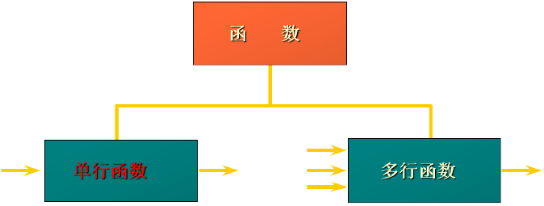

[toc]

# 1、单行函数

## 1.1、`mysql` 的内置函数及分类

mysql 提供了丰富的内置函数，这些函数使得数据维护与管理更加方便，能够更好的提供数据的分析与统计功能。

mysql 提供的内置函数从 实现的功能角度 可分为 数值函数、字符串函数、日期和时间函数、流程控制函数、加密与解密函数、获取mysql信息函数、聚合函数等。这里可以将这些丰富的内置函数再分为两类: 单行函数、聚合函数(或分组函数);



- 单行函数: 逐行处理数据，每行返回一个结果，不影响原行数
  - 输入一行，输出一行
  - 可以处理字符串、数值、日期等数据类型
  - 忽略 `NULL` 时可能返回 `NULL` (例如: `UPPER(NULL)` 的结果为 `NULL`)
- 聚合函数: 汇总多行数据，返回单个结果，通常与 `GROUP BY` 配合使用
  - 输入多行，输出一行
  - 忽略 `NULL` 值，(除了 `COUNT(*)` )
  - 未使用 `GROUP BY` 时，所有行视为一组;


## 1.2、数值函数

### 1.2.1、基本函数

| 函数 | 用法 |
| -- | -- |
| `ABS(x)` | 返回 `x` 的绝对值 |
| `SIGN(x)` | 返回 `x` 的符号，正数返回 1，负数返回 -1，0返回0 |
| `PI()`| 返回圆周率的值 |
| `CEIL(x)`, `CEILING(x)` | 返回大于或等于某个值的最小整数 |
| `FLOOR(x)` | 返回小于或等于某个值的最大整数 |
| `LEAST(e1, e2, e3...)` | 返回列表中的最小值 |
| `GREATEST(e1, e2, e3...)` | 返回列表中的最大值 |
| `MOD(x, y)` | 返回 `x` 除以 `y` 后的余数 |
| `RAND()` | 返回 `0~1` 之间的随机数 |
| `RAND(x)` | 返回 `0~1` 之间的随机数，其中 `x` 的值用作种子值，相同的 `x` 值会产生相同的随机数 |
| `ROUND(x)` | 返回一个对 `x` 的值进行四舍五入后最接近 `x` 的整数 |
| `ROUND(x, y)` | 返回一个对 `x` 的值进行四舍五入后最接近 `x` 的值，并保留到小数点后 `y` 位 |
| `TRUNCATE(x, y)` | 返回数字 `x`  截断为 `y` 位小数的结果 |
| `SQRT(x)` | 返回 `x` 的平方根，当 `x` 为负数时，返回 `NULL` |

```sql
select abs(-10), sign(10), sign(-10), sign(0), pi(), ceil(10.11), floor(10.11), least(10, 12, 11), greatest(10, 12, 11), mod(21, 5) from dual;
+----------+----------+-----------+---------+----------+-------------+--------------+-------------------+----------------------+------------+
| abs(-10) | sign(10) | sign(-10) | sign(0) | pi()     | ceil(10.11) | floor(10.11) | least(10, 12, 11) | greatest(10, 12, 11) | mod(21, 5) |
+----------+----------+-----------+---------+----------+-------------+--------------+-------------------+----------------------+------------+
|       10 |        1 |        -1 |       0 | 3.141593 |          11 |           10 |                10 |                   12 |          1 |
+----------+----------+-----------+---------+----------+-------------+--------------+-------------------+----------------------+------------+
1 row in set (0.00 sec)


# 随机数，指定随机数的种子后，相同的种子返回的随机数相同
select rand(), rand(), rand(3), rand(3), rand(3) from dual;
+--------------------+---------------------+--------------------+--------------------+--------------------+
| rand()             | rand()              | rand(3)            | rand(3)            | rand(3)            |
+--------------------+---------------------+--------------------+--------------------+--------------------+
| 0.8993600624607504 | 0.20253473352876933 | 0.9057697559760601 | 0.9057697559760601 | 0.9057697559760601 |
+--------------------+---------------------+--------------------+--------------------+--------------------+
1 row in set (0.00 sec)


# 四舍五入，以及四舍五入保留指定小数位数
select round(10.4), round(10.5), round(10.4444, 2), round(10.5555, 3), round(10.5555, 6) from dual;
+-------------+-------------+-------------------+-------------------+-------------------+
| round(10.4) | round(10.5) | round(10.4444, 2) | round(10.5555, 3) | round(10.5555, 6) |
+-------------+-------------+-------------------+-------------------+-------------------+
|          10 |          11 |             10.44 |            10.556 |           10.5555 |
+-------------+-------------+-------------------+-------------------+-------------------+
1 row in set (0.00 sec)

# 截断小数位
select truncate(10.123456, 5) from dual;
+------------------------+
| truncate(10.123456, 5) |
+------------------------+
|               10.12345 |
+------------------------+
1 row in set (0.00 sec)


# 计算平方根
select sqrt(2), sqrt(4) from dual;
+--------------------+---------+
| sqrt(2)            | sqrt(4) |
+--------------------+---------+
| 1.4142135623730951 |       2 |
+--------------------+---------+
1 row in set (0.00 sec)
```


## 1.3、字符串函数

> 注意: mysql 中字符串的位置是从 1 开始的

| 函数 | 用法 |
| -- | -- |
| `ASCII(s)` | 返回字符串 `s` 中第一个字符的 `ASCII` 码值 |
| `CHAR_LENGTH(s)` | 返回字符串 `s` 的字符数，作用与 `CHARACTER_LENGTH(s)` 相同 |
| `LENGTH(s)` | 返回字符串 `s` 的字节数，和字符集有关 |
| `CONCAT(s1, s2, .., sn)` | 连接字符串 `s1 - sn` 为一个字符串  |
| `CONCAT_WS(x, s1, s2, ..., sn)` | 同 `CONCAT(x)` 函数，但是每个字符串之间要加上 `x` 字符 |
| `INSERT(str，idx, len, replacestr)` | 将字符串 `str` 从 `idx` 位置开始 `len` 长度的内容替换为 `replacestr` |
| `REPLACE(str, a, b)` | 将字符串 `str` 中所有的 `a` 替换为 `b` |
| `UPPER(s)` 或 `UCAST(s)` | 将字符串 `s` 中的所有字母转成大写字母 |
| `LOWER(s)` 或 `LCAST(S)` | 将字符串 `s` 中的所有字母转成小写字母 |
| `LEFT(s, n)` | 返回字符串 `s` 左边的 `n` 个字符 |
| `RIGHT(s, n)` | 返回字符串 `s` 右边的 `n` 个字符 |
| `LPAD(str, len, pad)` | 使用 `pad` 填充 `str` 字符串的左侧，直到 `str` 的长度为 `len` 个字符 |
| `RPAD(str, len, pad)` | 使用 `pad` 填充 `str` 字符串的右侧，直到 `str` 的长度为 `len` 个字符 |
| `LTRIM(str)` | 去掉字符串 `str` 左侧的空格 |
| `RTRIM(str)` | 去掉字符串 `str` 右侧的空格 |
| `TRIM(str)` | 去掉字符串 `str` 左右两侧的空格 |
| `TRIM(s from str)` | 去掉字符串 `str` 左右两侧的 `s1` |
| `TRIM(LEADING s from str)` | 去掉字符串 `str` 开始处的 `s` 字符 |
| `TRIM(TRAILING s from str)` | 去掉字符串 `str` 结尾处的 `s` 字符 |
| `REPEAT(str, n)` | 返回 `str` 重复 `n` 次的结果 |
| `SPACE(n)` | 返回 `n` 个空格 |
| `STRCMP(s1, s2)` | 比较两个字符串 `s1` `s2` 的 `ASCII` 码值大小 |
| `SUBSTR(s, index, len)` | 返回字符串 `s` 从 `index` 位置开始，长度为 `len` 个字符的子串 |
| `LOCATE(substr, str)` | 返回 `substr` 字符串在 `str` 中首次出现的位置，未找到返回0 |
| `REVERSE(s)` | 反转字符串 `s` |

```sql
# 查询字符的ascii码
select ascii('a'), ascii('A'), ascii('aa'), ascii('中') from dual;
+------------+------------+-------------+-------------+
| ascii('a') | ascii('A') | ascii('aa') | ascii('中') |
+------------+------------+-------------+-------------+
|         97 |         65 |          97 |         214 |
+------------+------------+-------------+-------------+
1 row in set (0.00 sec)


# 查询字符串的字符数
select char_length('abc'), char_length(''), char_length('中') from dual;
+--------------------+-----------------+-------------------+
| char_length('abc') | char_length('') | char_length('中') |
+--------------------+-----------------+-------------------+
|                  3 |               0 |                 1 |
+--------------------+-----------------+-------------------+
1 row in set (0.00 sec)

# 查询字符串的字节数
select length('abc'), length(''), length('中') from dual;
+---------------+------------+--------------+
| length('abc') | length('') | length('中') |
+---------------+------------+--------------+
|             3 |          0 |            2 |
+---------------+------------+--------------+
1 row in set (0.00 sec)

# 拼接字符串
select concat('a', 'b', 'c'), concat('hello', 'world'), concat_ws('+', '1', '2') from dual;
+-----------------------+--------------------------+--------------------------+
| concat('a', 'b', 'c') | concat('hello', 'world') | concat_ws('+', '1', '2') |
+-----------------------+--------------------------+--------------------------+
| abc                   | helloworld               | 1+2                      |
+-----------------------+--------------------------+--------------------------+
1 row in set (0.00 sec)

# mysql 中字符串的下标从 1 开始
# 字符串替换，insert(str, idx, len, replacestr) -> 将 str 字符串 从 idx 位置开始，长度为 len 的区域替换成 replacestr
select insert('abcdef', 2, 3, 'w'), insert('abcdef', 10, 2, '2'), insert('abc', 0, 2, 'w') from dual;
+-----------------------------+------------------------------+--------------------------+
| insert('abcdef', 2, 3, 'w') | insert('abcdef', 10, 2, '2') | insert('abc', 0, 2, 'w') |
+-----------------------------+------------------------------+--------------------------+
| awef                        | abcdef                       | abc                      |
+-----------------------------+------------------------------+--------------------------+
1 row in set (0.00 sec)

# 字符串替换 replace(str, a, b) -> 将字符串 str 中 所有的 a 替换为 b
select replace('abcabcabc', 'a', 'A') from dual;
+--------------------------------+
| replace('abcabcabc', 'a', 'A') |
+--------------------------------+
| AbcAbcAbc                      |
+--------------------------------+
1 row in set (0.00 sec)

# 字符串最大值，最小值转换
select upper('abc'), upper('aBC123'), ucase('abc'), lower('abc'), lower('Abc'), lcase('ABc123') from dual;
+--------------+-----------------+--------------+--------------+--------------+-----------------+
| upper('abc') | upper('aBC123') | ucase('abc') | lower('abc') | lower('Abc') | lcase('ABc123') |
+--------------+-----------------+--------------+--------------+--------------+-----------------+
| ABC          | ABC123          | ABC          | abc          | abc          | abc123          |
+--------------+-----------------+--------------+--------------+--------------+-----------------+
1 row in set (0.00 sec)


# 截取左边或右边的字符串 left(str, len)  right(str, len) 截取字符串的左侧或右侧长度为len个字符的字符串
select left('abcdef', 3), right('abcdef', 3) from dual;
+-------------------+--------------------+
| left('abcdef', 3) | right('abcdef', 3) |
+-------------------+--------------------+
| abc               | def                |
+-------------------+--------------------+
1 row in set (0.00 sec)


# 字符串填充 lpad(str, len, pad)  rpad(str, len, pad) 填充使用 pad 填充 str 的左侧或右侧，直到str长度为len
select lpad('abc', 10, '12'), rpad('abc', 10, '12') from dual;
+-----------------------+-----------------------+
| lpad('abc', 10, '12') | rpad('abc', 10, '12') |
+-----------------------+-----------------------+
| 1212121abc            | abc1212121            |
+-----------------------+-----------------------+
1 row in set (0.00 sec)

# 字符串 trim 操作
select ltrim(' abc '), rtrim(' abc '), trim(' abc '), trim('ab' from 'ab123ab') from dual;
+----------------+----------------+---------------+---------------------------+
| ltrim(' abc ') | rtrim(' abc ') | trim(' abc ') | trim('ab' from 'ab123ab') |
+----------------+----------------+---------------+---------------------------+
| abc            |  abc           | abc           | 123                       |
+----------------+----------------+---------------+---------------------------+
1 row in set (0.00 sec)

# 重复字符串 repeat(str, n)
select repeat('abc', 3) from dual;
+------------------+
| repeat('abc', 3) |
+------------------+
| abcabcabc        |
+------------------+
1 row in set (0.00 sec)


# 字符串截取 substr(str, idx, len)
select substr('abcdef', 2, 3), substr('abc', 10, 10) from dual;
+------------------------+-----------------------+
| substr('abcdef', 2, 3) | substr('abc', 10, 10) |
+------------------------+-----------------------+
| bcd                    |                       |
+------------------------+-----------------------+
1 row in set (0.00 sec)

# 反转字符串 reverse(str)
select reverse('abc') from dual;
+----------------+
| reverse('abc') |
+----------------+
| cba            |
+----------------+
1 row in set (0.00 sec)
```

## 1.4、日期和时间函数

| 函数 | 用法 |
| -- | -- |
| `CURDATE()` 或 `CURRENT_DATE()` | 返回当前日期，包含 年月日 |
| `CURTIME()` 或 `CURRENT_TIME()` | 返回当前时间，包含 时分秒 |
| `NOW()/SYSDATE()/CURRENT_TIMESTAMP()/LOCALTIME()/LOCALTIMESTAMP()` | 返回当前系统日期和时间 |
| `UTC_DATE()` | 返回 `UTC` 日期 |
| `UTC_TIME()` | 返回 `UTC` 时间 |

```sql
select curdate(), current_date(), curtime(), current_time(), now(), sysdate(), current_timestamp(), localtime() from dual;

+------------+----------------+-----------+----------------+---------------------+---------------------+---------------------+---------------------+
| curdate()  | current_date() | curtime() | current_time() | now()               | sysdate()           | current_timestamp() | localtime()         |
+------------+----------------+-----------+----------------+---------------------+---------------------+---------------------+---------------------+
| 2025-05-18 | 2025-05-18     | 09:17:08  | 09:17:08       | 2025-05-18 09:17:08 | 2025-05-18 09:17:08 | 2025-05-18 09:17:08 | 2025-05-18 09:17:08 |
+------------+----------------+-----------+----------------+---------------------+---------------------+---------------------+---------------------+
1 row in set (0.00 sec)
```

## 1.5、日期与时间戳的转换

| 函数 | 用法 |
| -- | -- |
| `UNIX_TIMESTAMP()` | 以 `UNIX` 时间戳的形式返回当前时间。 |
| `UNIX_TIMESTAMP(date)` | 将时间 `date` 以 `unix` 时间戳的形式返回。 |
| `FROM_UNIXTIME(timestamp)` | 将 `unix` 时间戳的时间转换为普通格式的时间。 |

```sql
select unix_timestamp(), unix_timestamp('2025-01-01'), unix_timestamp('2025-01-01 12:12:12'), from_unixtime(unix_timestamp('2025-01-01')) from dual;
+------------------+------------------------------+---------------------------------------+---------------------------------------------+
| unix_timestamp() | unix_timestamp('2025-01-01') | unix_timestamp('2025-01-01 12:12:12') | from_unixtime(unix_timestamp('2025-01-01')) |
+------------------+------------------------------+---------------------------------------+---------------------------------------------+
|       1747634358 |                   1735660800 |                            1735704732 | 2025-01-01 00:00:00                         |
+------------------+------------------------------+---------------------------------------+---------------------------------------------+
1 row in set (0.00 sec)
```


## 1.6、流程控制函数

流程控制函数可以根据不同的条件，执行不同的处理流程。可以在 sql 语句中实现不同的条件选择。

mysql 中的流程处理函数主要包括 `IF()`，`IFNULL()`，`CASE()` 函数。

| 函数 | 用法 |
| -- | -- |
| `IF(value, value1, value2)` | 如果 `value` 的值为 `TRUE` , 返回 `value1` 否则返回 `value2` |
| `IFNULL(value1, value2)` | 如果 `value1` 不为 `null` 返回 `value1` 否则返回 `value2` |
| `CASE WHEN` 条件1 `THEN` 结果1 </br> `WHEN` 条件2 `THEN` 结果2 </br> ...[ELSE resultn] END | 相当于 java 的 `if ... else if ... else ..` |
| `CASE expr WHEN` 常量值1 `THEN` 值1 </br> `WHEN` 常量值2 `THEN` 值2 ...[ELSE 值n]END | 相当于 java 的 `switch...case` |

```sql
select if(1>0, 'true', 'false'), if(1<0, 'aa', 'bb'), ifnull(1, 2), ifnull(null, 2) from dual;
+--------------------------+---------------------+--------------+-----------------+
| if(1>0, 'true', 'false') | if(1<0, 'aa', 'bb') | ifnull(1, 2) | ifnull(null, 2) |
+--------------------------+---------------------+--------------+-----------------+
| true                     | bb                  |            1 |               2 |
+--------------------------+---------------------+--------------+-----------------+
1 row in set (0.00 sec)

# CASE WHEN ... THEN ... 
select case when salary > 10000 and salary < 15000 then '一般般' when salary > 15000 then '很不错' else '未知' end from employees;

select case 
when salary > 10000 and salary < 15000 then '一般般' 
when salary > 15000 then '很不错' 
else '未知' 
end 
from employees;
```


# 2、聚合函数

聚合函数作用于一组数据，并对一组数据返回一个值。

聚合函数类型:

- `AVG()`
- `SUM()`
- `MAX()`
- `MIN()`
- `COUNT()`

聚合函数不能嵌套调用，例如不能出现 `AVG(SUM(字段名称))` 的调用方式。

## 2.1、计算平均值，求和，计数

```sql
select avg(salary), sum(salary), count(salary), sum(salary) / count(salary) from employees;

+-------------+-------------+---------------+-----------------------------+
| avg(salary) | sum(salary) | count(salary) | sum(salary) / count(salary) |
+-------------+-------------+---------------+-----------------------------+
| 6461.682243 |   691400.00 |           107 |                 6461.682243 |
+-------------+-------------+---------------+-----------------------------+
1 row in set (0.00 sec)
```

> count 函数

- `count(*)` 返回表中记录总数，适用于任意数据类型。
- `count(expr)` 返回 `expr` 不为空的记录总数。


```sql
select count(*), count(salary), count(commission_pct) from employees;

+----------+---------------+-----------------------+
| count(*) | count(salary) | count(commission_pct) |
+----------+---------------+-----------------------+
|      107 |           107 |                    35 |
+----------+---------------+-----------------------+
1 row in set (0.00 sec)
```

> 问题: 用 `count(*)`, `count(1)`, `count(字段名)` 哪个更好?

对于 `MyISAM` 引擎的表是没有区别的，这种引擎内部有一个计数器在维护着行数。
对于 `InnoDB` 引擎的表，用 `count(*)`, `count(1)` 直接读取行数，复杂度是 `O(n)`，因为 `InnoDB` 真的要去数一遍，但好于具体的 `count(字段名)`。

> 问题: 能否使用 `count(字段名)` 替换 `count(*)`

不能使用 `count(字段名)` 替换 `count(*)`，`count(*)` 是 sql92 定义的标准统计函数的语法，跟数据库无关，跟 `NULL` 和 非 `NULL` 无关；

`count(*)` 会统计值为 `NULL` 的行；
`count(字段名)` 不会统计此列为 `NULL` 值的行；

## 2.2、计算最大值/最小值

```sql
select max(salary), min(salary) from employees;

+-------------+-------------+
| max(salary) | min(salary) |
+-------------+-------------+
|    24000.00 |     2100.00 |
+-------------+-------------+
1 row in set (0.00 sec)
```


## 2.3、`GROUP BY` 分组

使用 `GROUP BY` 子句可以将表中的数据分成若干组。

```sql
select department_id, avg(salary) from employees group by department_id;

# sql 执行顺序分析
# 1. 执行 from 子句，从 employees 表中查询出所有数据;
# 2. 执行 group by 子句，根据 department_id 字段将数据分组，相同的 department_id 分为一个组;
# 3. 聚合计算 avg(salary)，对每个分组中的 salary 字段使用 avg() 函数计算平均值，这里得到的是每个分组的 salary 的平均值;
# 4. 执行 select 子句，最终选择 department_id 和 对应分组的平均工资作为结果返回;

+---------------+--------------+
| department_id | avg(salary)  |
+---------------+--------------+
|          NULL |  7000.000000 |
|            10 |  4400.000000 |
|            20 |  9500.000000 |
|            30 |  4150.000000 |
|            40 |  6500.000000 |
|            50 |  3475.555556 |
|            60 |  5760.000000 |
|            70 | 10000.000000 |
|            80 |  8955.882353 |
|            90 | 19333.333333 |
|           100 |  8600.000000 |
|           110 | 10150.000000 |
+---------------+--------------+
12 rows in set (0.00 sec)
```

## 2.4、`HAVING`

`HAVING` 是 sql 中用于过滤 分组 (`GROUP BY`) 后的结果的子句，类似于 `WHERE`，但核心区别在于:

- `WHERE`: 在分组前过滤原始数据行;
- `HAVING`: 在分组后过滤聚合后的分组结果;

```sql
# 过滤出平均工资超过 10000 的部门;
select department_id, avg(salary) from employees group by department_id having avg(salary) > 10000;

+---------------+--------------+
| department_id | avg(salary)  |
+---------------+--------------+
|            90 | 19333.333333 |
|           110 | 10150.000000 |
+---------------+--------------+
2 rows in set (0.00 sec)
```
