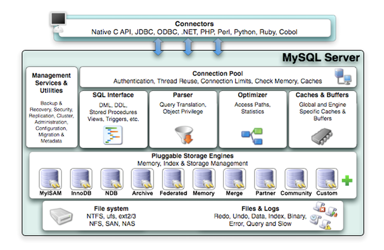
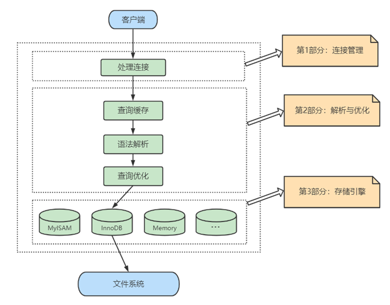
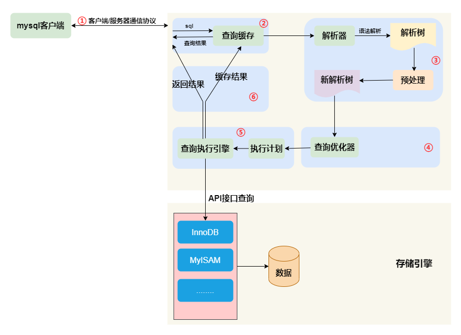
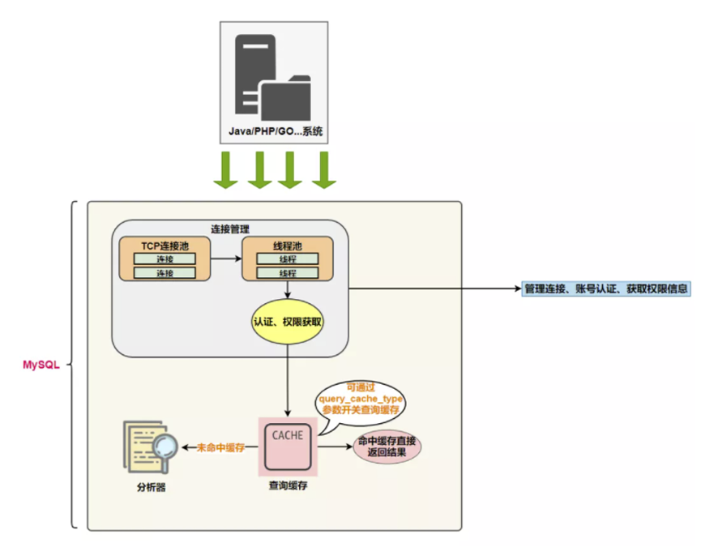
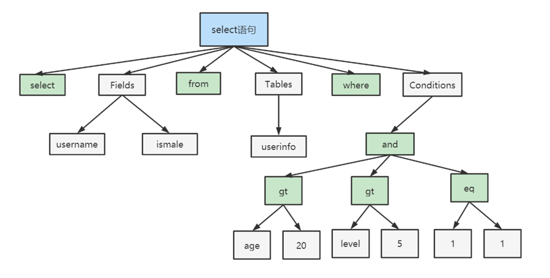
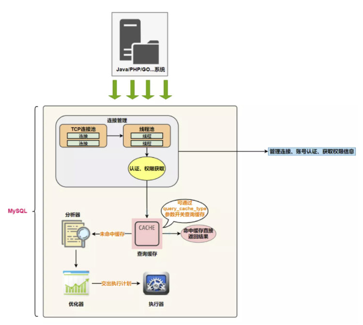
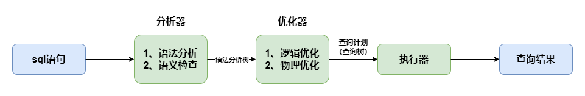

[toc]


# 1、逻辑架构剖析

## 1.1、服务器处理客户端请求

MySQL处理客户端请求的完整流程可归纳为以下四个环节：

- 连接管理：建立连接、身份验证、分配线程。
- `SQL` 解析与预处理：语法检查、语义校验、权限验证。
- 查询优化与执行：优化器选择最佳执行计划，执行引擎调用存储引擎接口。
- 存储引擎与磁盘文件交互：通过缓冲池、日志（`redo`/`undo`）和表空间文件完成数据的实际读写。

这四个阶段层层递进，共同完成一次客户端请求的处理。



`mysql` 客户端发起一次查询请求的流程如下:




### 1.1.1、`Connectors`

系统 (客户端) 访问 `MYSQL` 服务器前，做的第一件事就是建立 `TCP` 连接。

经过三次握手建立连接成功后，`MySQL` 服务器对 `TCP` 传输过来的账号密码做身份认证、权限获取。

- 用户名或密码不对，会收到一个`Access denied for user` 错误，客户端程序结束执行;
- 用户名密码认证通过，会从权限表查出账号拥有的权限与连接关联，之后的权限判断逻辑，都将依赖于此时读到的权限;

`TCP` 连接收到请求后，必须要分配给一个线程专门与这个客户端的交互。所以还会有个线程池，去走后面的流程。每一个连接从线程池中获取线程，省去了创建和销毁线程的开销。

### 1.1.2、服务层

> `SQL Interface`: `SQL` 接口

- 接收用户的 `SQL` 命令，并且返回用户需要查询的结果。比如 `SELECT ... FROM` 就是调用 `SQL Interface`;
- `MySQL` 支持 `DML`（数据操作语言）、`DDL`（数据定义语言）、存储过程、视图、触发器、自定义函数等多种 `SQL` 语言接口;

> `Parser`: 解析器

- 在解析器中对 `SQL` 语句进行语法分析、语义分析。将 `SQL` 语句分解成数据结构，并将这个结构传递到后续步骤，以后`SQL`语句的传递和处理就是基于这个结构的。如果在分解构成中遇到错误，那么就说明这个`SQL`语句是不合理的。
- 在 `SQL` 命令传递到解析器的时候会被解析器验证和解析，并为其创建 **语法树**，并根据数据字典丰富查询语法树，会验证该客户端是否具有执行该查询的权限。创建好语法树后，`MySQL` 还会对 `SQL` 查询进行语法上的优化，进行查询重写。

> `Optimizer`: 查询优化器

- `SQL` 语句在语法解析之后、查询之前会使用查询优化器确定 `SQL` 语句的执行路径，生成一个 **执行计划**。
- 这个执行计划表明应该 **使用哪些索引** 进行查询（全表检索还是使用索引检索），表之间的连接顺序如何，最后会按照执行计划中的步骤调用存储引擎提供的方法来真正的执行查询，并将查询结果返回给用户。
- 它使用 **选取-投影-连接** 策略进行查询。例如：`ELECT id,name FROM student WHERE gender = '女';`
    - 这个 `SELECT` 查询先根据 `WHERE`语句进行选取，而不是将表全部查询出来以后再进行`gender`过滤。 
    - 这个 `SELECT` 查询先根据 `id` 和 `name` 进行属性投影，而不是将属性全部取出以后再进行过滤，将这两个查询条件连接起来生成最终查询结果。

> `Caches & Buffers`： 查询缓存组件

- `MySQL` 内部维持着一些 `Cache` 和 `Buffer`，比如 `Query Cache` 用来缓存一条 `SELECT` 语句的执行结果，如果能够在其中找到对应的查询结果，那么就不必再进行查询解析、优化和执行的整个过程了，直接将结果反馈给客户端。
- 这个缓存机制是由一系列小缓存组成的。比如表缓存，记录缓存，key缓存，权限缓存等 。
- 这个查询缓存可以在不同客户端之间共享。
- 从 `MySQL 5.7.20` 开始，不推荐使用查询缓存，并在 `MySQL 8.0` 中删除;

### 1.1.3、引擎层

插件式存储引擎层（ `Storage Engines` ），真正的负责了 `MySQL` 中数据的存储和提取，对物理服务器级别维护的底层数据执行操作，服务器通过 `API` 与存储引擎进行通信。

不同的存储引擎具有的功能不同，这样我们可以根据自己的实际需要进行选取。

> `mysql8.4` 支持的存储引擎

```shell
mysql> select version();
+-----------+
| version() |
+-----------+
| 8.4.11    |
+-----------+
1 row in set (0.01 sec)

mysql> show engines;
+--------------------+---------+----------------------------------------------------------------+--------------+------+------------+
| Engine             | Support | Comment                                                        | Transactions | XA   | Savepoints |
+--------------------+---------+----------------------------------------------------------------+--------------+------+------------+
| ndbcluster         | NO      | Clustered, fault-tolerant tables                               | NULL         | NULL | NULL       |
| MEMORY             | YES     | Hash based, stored in memory, useful for temporary tables      | NO           | NO   | NO         |
| InnoDB             | DEFAULT | Supports transactions, row-level locking, and foreign keys     | YES          | YES  | YES        |
| PERFORMANCE_SCHEMA | YES     | Performance Schema                                             | NO           | NO   | NO         |
| MyISAM             | YES     | MyISAM storage engine                                          | NO           | NO   | NO         |
| FEDERATED          | NO      | Federated MySQL storage engine                                 | NULL         | NULL | NULL       |
| ndbinfo            | NO      | MySQL Cluster system information storage engine                | NULL         | NULL | NULL       |
| MRG_MYISAM         | YES     | Collection of identical MyISAM tables                          | NO           | NO   | NO         |
| BLACKHOLE          | YES     | /dev/null storage engine (anything you write to it disappears) | NO           | NO   | NO         |
| CSV                | YES     | CSV storage engine                                             | NO           | NO   | NO         |
| ARCHIVE            | YES     | Archive storage engine                                         | NO           | NO   | NO         |
+--------------------+---------+----------------------------------------------------------------+--------------+------+------------+
11 rows in set (0.00 sec)

mysql>
```

> `mysql5.7` 支持的存储引擎

```shell
mysql> select version();
+-----------+
| version() |
+-----------+
| 5.7.44    |
+-----------+
1 row in set (0.00 sec)

mysql> show engines;
+--------------------+---------+----------------------------------------------------------------+--------------+------+------------+
| Engine             | Support | Comment                                                        | Transactions | XA   | Savepoints |
+--------------------+---------+----------------------------------------------------------------+--------------+------+------------+
| InnoDB             | DEFAULT | Supports transactions, row-level locking, and foreign keys     | YES          | YES  | YES        |
| MRG_MYISAM         | YES     | Collection of identical MyISAM tables                          | NO           | NO   | NO         |
| MEMORY             | YES     | Hash based, stored in memory, useful for temporary tables      | NO           | NO   | NO         |
| BLACKHOLE          | YES     | /dev/null storage engine (anything you write to it disappears) | NO           | NO   | NO         |
| MyISAM             | YES     | MyISAM storage engine                                          | NO           | NO   | NO         |
| CSV                | YES     | CSV storage engine                                             | NO           | NO   | NO         |
| ARCHIVE            | YES     | Archive storage engine                                         | NO           | NO   | NO         |
| PERFORMANCE_SCHEMA | YES     | Performance Schema                                             | NO           | NO   | NO         |
| FEDERATED          | NO      | Federated MySQL storage engine                                 | NULL         | NULL | NULL       |
+--------------------+---------+----------------------------------------------------------------+--------------+------+------------+
9 rows in set (0.00 sec)

mysql>
```

### 1.1.4、存储层

所有的数据，数据库、表的定义，表的每一行的内容，索引，都是存在 **文件系统** 上，以 **文件** 的方式存在的，并完成与存储引擎的交互。

当然有些存储引擎比如 `InnoDB` ，也支持不使用文件系统直接管理裸设备，但现代文件系统的实现使得这样做没有必要了。在文件系统之下，可以使用本地磁盘，可以使用 `DAS`、NAS`、`SAN`等各种存储系统。


## 1.2、`SQL` 执行流程



### 1.2.1、查询缓存

`Server` 如果在查询缓存中发现了这条 `SQL` 语句，就会直接将结果返回给客户端；如果没有，就进入到解析器阶段。需要说明的是，**因为查询缓存往往效率不高，所以在 MySQL8.0 之后就抛弃了这个功能**。



> 大多数情况查询缓存就是个鸡肋

```sql
SELECT employee_id,last_name FROM employees WHERE employee_id = 101;
```

查询缓存是提前把查询结果缓存起来，这样下次不需要执行就可以直接拿到结果。需要说明的是，在 `MySQL` 中的查询缓存，不是缓存查询计划，而是查询对应的结果。这就意味着查询匹配的 **鲁棒性大大降低** ，只有相同的查询操作才会命中查询缓存。两个查询请求在任何字符上的不同（例如：空格、注释、大小写），都会导致缓存不会命中。因此 `MySQL` 的查询缓存命中率不高。

同时，如果查询请求中包含某些系统函数、用户自定义变量和函数、一些系统表，如 `mysql` 、`information_schema`、 `performance_schema` 数据库中的表，那这个请求就不会被缓存。以某些系统函数举例，可能同样的函数的两次调用会产生不一样的结果，比如函数 `NOW` ，每次调用都会产生最新的当前时间，如果在一个查询请求中调用了这个函数，那即使查询请求的文本信息都一样，那不同时间的两次查询也应该得到不同的结果，如果在第一次查询时就缓存了，那第二次查询的时候直接使用第一次查询的结果就是错误的;


此外，既然是缓存，那就有它缓存失效的时候。`MySQL` 的缓存系统会监测涉及到的每张表，只要该表的结构或者数据被修改，如对该表使用了 `INSERT` 、 `UPDATE`、`DELETE`、`TRUNCATE TABLE`、` ALTER TABLE` 、`DROP TABLE` 或 `DROP DATABASE` 语句，那使用该表的所有高速缓存查询都将变为无效并从高
速缓存中删除！对于更新压力大的数据库来说，查询缓存的命中率会非常低。

### 1.2.2、解析器

`MySql` 在解析器中对 `SQL` 语句进行语法分析、语义分析。

分析器先做 **词法分析**。`SQL` 输入的是由多个字符串和空格组成的一条语句，`MySQL` 需要识别出里面的字符串分别是什么，代表什么。 `MySQL` 从输入的**select** 这个关键字识别出来，这是一个查询语句。它也要把字符串 **T** 识别成 **表名 T** ，把字符串 **ID** 识别成 **列 ID**;

接着，要做 **语法分析**。根据词法分析的结果，语法分析器（比如：`Bison`）会根据语法规则，判断输入的这个 `SQL` 语句是否满足 `MySQL` 语法。例如下面的 `SQL` 语句:

```sql
select department_id,job_id,avg(salary) from employees group by department_id;
```

如果SQL语句正确，则会生成一个这样的语法树：



### 1.2.3、优化器

在优化器中会确定 `SQL` 语句的执行路径，比如是根据 **全表检索** ，还是根据 **索引检索** 等。

举例：如下语句是执行两个表的 join：

```sql
select * from test1 join test2 using(ID) where test1.name='zhangwei' and test2.name='mysql高级课程';
```

- 方案1：可以先从表 `test1` 里面取出 `name='zhangwei'` 的记录的 `ID` 值，再根据 `ID` 值关联到表 `test2`，再判断 `test2` 里面 `name` 的值是否等于 `'mysql高级课程'`。
- 方案2：可以先从表 `test2` 里面取出 `name='mysql高级课程'` 的记录的 `ID` 值，再根据 `ID` 值关联到 `test1`，再判断 `test1` 里面 `name`的值是否等于 `zhangwei`。

这两种执行方法的逻辑结果是一样的，但是执行的效率会有不同，而优化器的作用就是决定选择使用哪一个方案。优化器阶段完成后，这个语句的执行方案就确定下来了，然后进入执行器阶段。

### 1.2.4、执行器

截止到现在，还没有真正去读写真实的表，仅仅只是产出了一个执行计划。于是就进入了 **执行器阶段**



在执行之前需要判断该用户是否具备权限。

- 没有权限，返回权限错误。
- 具备权限，执行 `SQL` 查询并返回结果。在 `MySQL8.0` 以下的版本，如果设置了查询缓存，这时会将查询结果进行缓存。

```sql
select * from test where id=1;
```

例如上面的 `sql` 语句， 表 `test` 中，`ID` 字段没有索引，那么执行器的执行流程是这样的：

- 调用 `InnoDB` 引擎接口取这个表的第一行，判断 `ID` 值是不是 `1`;
    - 如果不是则跳过
    - 如果是则将这行存在结果集中；
- 调用引擎接口取 **下一行**，重复相同的判断逻辑，直到取到这个表的最后一行。
- 执行器将上述遍历过程中所有满足条件的行组成的记录集作为结果集返回给客户端。

`SQL` 语句在 `MySQL` 中的流程为：`SQL语句 → 查询缓存 → 解析器 → 优化器 → 执行器。`




# 3、数据库缓冲池 (`buffer pool`)


