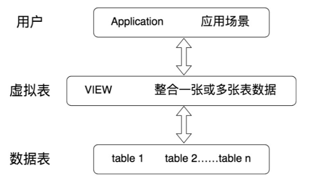
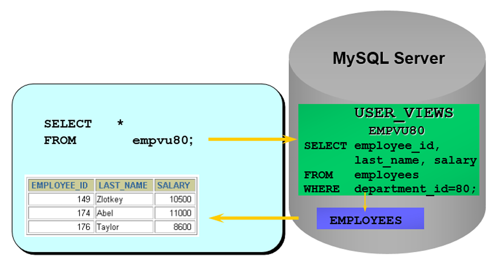

[toc]

# 1、常见的数据库对象

| 对象                     | 描述                                                                                              |
| ------------------------ | ------------------------------------------------------------------------------------------------- |
| 表 ( `TABLE` )           | 表是存储数据的逻辑单元，以行和列的形式存在，列就是字段，行就是记录                                |
| 数据字典                 | 就是系统表，存放数据库相关信息的表。系统表的数据通常由数据库系统维护，开发者不应该修改，只能查看; |
| 约束 ( `CONSTRAINT` )    | 执行数据校验的规则，用于保证数据完整性的规则;                                                     |
| 视图 ( `VIEW` )          | 一个或多个数据表里的数据的的逻辑显示，视图并不存储数据；                                          |
| 索引 ( `INDEX` )         | 用于提高查询性能，相当于书的目录;                                                                 |
| 存储过程 ( `PROCEDURE` ) | 用于完成一次完整的业务处理，没有返回值，但可以通过传参将多个值传给调用环境;                       |
| 存储函数 ( `FUNCTION` )  | 用于完成一次特定的计算，具有一个返回值;                                                           |
| 触发器 ( `TRIGGER` )     | 相当于一个事件监听器，当数据库发生特定的事件后，触发器被触发，完成相应的处理;                     |

# 2、视图

## 2.1、为什么要使用视图

视图一方面可以帮助我们使用表的一部分而不是所有的表，另一方面可以针对不同的用户制定不同的查询视图。例如，针对一个公司的销售人员，只想给他看部分数据，而某些特殊的数据不会提供给他。

## 2.2、视图的理解

- 视图是一种 虚拟表，本身是不具有数据的，占用很少的内存空间，他是 `SQL` 中的一个重要概念；
- 视图建立在已有表的基础上，视图依赖建立的这些表称为基表;



- 视图的创建和删除只影响视图本身，不影响对应的基表。
- 对视图中的数据进行 增删改 操作时，数据表中的数据会发生相应的变化，反之亦然；
- 向视图提供数据内容的语句为 `SELECT` 语句，可以将视图理解为 存储起来的 `SELECT` 语句;
  - 在数据库中，视图不会保存数据，数据真正保存在数据表中。当对视图中的数据进行 增删改 操作时，数据表中的数据会发生相应的变化，反之亦然;
- 视图是向用户提供基表数据的另一种表现形式，通常情况下，小型项目的数据库可以不使用视图，但是在大型项目中，以及数据表比较复杂的情况下，视图的价值就凸显出来了，它可以将经常使用的结果集放到虚拟表中，提升使用效率。

个人理解:
1. 视图是一个虚拟表，本质是一条保存起来的 `SELECT` 查询语句，并赋予一个名称（别名）。
2. 它不存储实际数据，只存储查询定义。

## 2.3、创建视图

- 在 `CREATE VIEW` 语句中嵌入子查询；

```sql
CREATE [OR REPLACE]
[ALGORITHM = {UNDEFIND | MERGE | TEMPTABLE}]
VIEW 视图名称 [{字段列表}]
AS 查询语句
[WITH [CASCADED|LOCAL] CHECK OPTION]

# ============================= 精简版 =============================

CREATE VIEW 视图名称 AS 查询语句
```

### 2.3.1、创建简单表视图

基于 [atguigu.sql](./sql/atguigu.sql) 数据文件

```sql
create view empvu80
as
select employee_id, last_name, salary from employees where department_id = 80;

desc empvu80;
+-------------+-------------+------+-----+---------+-------+
| Field       | Type        | Null | Key | Default | Extra |
+-------------+-------------+------+-----+---------+-------+
| employee_id | int         | NO   |     | 0       |       |
| last_name   | varchar(25) | NO   |     | NULL    |       |
| salary      | double(8,2) | YES  |     | NULL    |       |
+-------------+-------------+------+-----+---------+-------+
3 rows in set (0.00 sec)

select * from empvu80;
+-------------+------------+----------+
| employee_id | last_name  | salary   |
+-------------+------------+----------+
|         145 | Russell    | 14000.00 |
|         146 | Partners   | 13500.00 |
|         147 | Errazuriz  | 12000.00 |
|         148 | Cambrault  | 11000.00 |
|         149 | Zlotkey    | 10500.00 |
|         150 | Tucker     | 10000.00 |
|         ... | .........  |  ....... |
|         175 | Hutton     |  8800.00 |
|         176 | Taylor     |  8600.00 |
|         177 | Livingston |  8400.00 |
|         179 | Johnson    |  6200.00 |
+-------------+------------+----------+
34 rows in set (0.02 sec)
```



1. 实际上就是我们在 `SQL` 查询语句的基础上封装了视图 `VIEW`，这样就会基于 `SQL` 语句的结果集形成一张虚拟表。
2. 在创建视图时，没有在视图名后面指定字段列表，则视图中字段列表默认和SELECT语句中的字段列表一致。如果SELECT语句中给字段取了别名，那么视图中的字段名和别名相同。

### 2.3.2、创建多表联合视图

```sql
create view empview
as
select e.employee_id emp_id, e.last_name name, d.department_name from employees e, departments d where e.department_id = d.department_id;

desc empview;
+-----------------+-------------+------+-----+---------+-------+
| Field           | Type        | Null | Key | Default | Extra |
+-----------------+-------------+------+-----+---------+-------+
| emp_id          | int         | NO   |     | 0       |       |
| name            | varchar(25) | NO   |     | NULL    |       |
| department_name | varchar(30) | NO   |     | NULL    |       |
+-----------------+-------------+------+-----+---------+-------+
3 rows in set (0.00 sec)

mysql> select * from empview;
+--------+-------------+------------------+
| emp_id | name        | department_name  |
+--------+-------------+------------------+
|    200 | Whalen      | Administration   |
|    201 | Hartstein   | Marketing        |
|    202 | Fay         | Marketing        |
|    114 | Raphaely    | Purchasing       |
|    115 | Khoo        | Purchasing       |
....
|    111 | Sciarra     | Finance          |
|    112 | Urman       | Finance          |
|    113 | Popp        | Finance          |
|    205 | Higgins     | Accounting       |
|    206 | Gietz       | Accounting       |
+--------+-------------+------------------+
106 rows in set (0.08 sec)
```

### 2.3.3、基于视图创建视图

当我们创建好一张视图之后，还可以在它的基础上继续创建视图。

例如: 联合 `emp_dept` 视图和 `emp_year_salary` 视图查询员工姓名、部门名称、年薪信息创建 `emp_dept_ysalary`视图

```sql
CREATE VIEW emp_dept_ysalary
AS 
SELECT emp_dept.ename,dname,year_salary
FROM emp_dept INNER JOIN emp_year_salary
ON emp_dept.ename = emp_year_salary.ename
```

## 2.4、查看视图

```sql
# 查看数据库表对象、视图对象
show tables;

# 查看视图结构
desc 视图名称；

mysql> desc empview;
+-----------------+-------------+------+-----+---------+-------+
| Field           | Type        | Null | Key | Default | Extra |
+-----------------+-------------+------+-----+---------+-------+
| emp_id          | int         | NO   |     | 0       |       |
| name            | varchar(25) | NO   |     | NULL    |       |
| department_name | varchar(30) | NO   |     | NULL    |       |
+-----------------+-------------+------+-----+---------+-------+
3 rows in set (0.02 sec)


# 查看视图的属性信息
show table status like '视图名称'\G;

mysql> show table status like 'empview'\G;
*************************** 1. row ***************************
           Name: empview
         Engine: NULL
        Version: NULL
     Row_format: NULL
           Rows: NULL
 Avg_row_length: NULL
    Data_length: NULL
Max_data_length: NULL
   Index_length: NULL
      Data_free: NULL
 Auto_increment: NULL
    Create_time: 2025-06-14 11:07:31
    Update_time: NULL
     Check_time: NULL
      Collation: NULL
       Checksum: NULL
 Create_options: NULL
        Comment: VIEW                   # comment: view 表示这张表是视图
1 row in set (0.00 sec)

ERROR:
No query specified

# 查看视图定义信息
show create view 视图名称；

mysql> show create view empview\G;
*************************** 1. row ***************************
                View: empview
         Create View: CREATE ALGORITHM=UNDEFINED DEFINER=`root`@`localhost` SQL SECURITY DEFINER VIEW `empview` AS select `e`.`employee_id` AS `emp_id`,`e`.`last_name` AS `name`,`d`.`department_name` AS `department_name` from (`employees` `e` join `departments` `d`) where (`e`.`department_id` = `d`.`department_id`)
character_set_client: gbk
collation_connection: gbk_chinese_ci
1 row in set (0.00 sec)

ERROR:
No query specified
```

# 3、更新视图的数据

## 3.1、一般情况

`MySQL` 支持使用 `INSERT`、`UPDATE` 和 `DELETE` 语句对视图中的数据进行插入、更新和删除操作。当视图中的数据发生变化时，数据表中的数据也会发生变化，反之亦然。

```sql

# ================================= 创建表 =================================

mysql> create table if not exists user(id int primary key auto_increment, name varchar(20), dept_id int, age int, cert_no varchar(20));
Query OK, 0 rows affected (0.09 sec)

mysql> desc user;
+---------+-------------+------+-----+---------+----------------+
| Field   | Type        | Null | Key | Default | Extra          |
+---------+-------------+------+-----+---------+----------------+
| id      | int         | NO   | PRI | NULL    | auto_increment |
| name    | varchar(20) | YES  |     | NULL    |                |
| dept_id | int         | YES  |     | NULL    |                |
| age     | int         | YES  |     | NULL    |                |
| cert_no | varchar(20) | YES  |     | NULL    |                |
+---------+-------------+------+-----+---------+----------------+
5 rows in set (0.00 sec)

mysql> create table if not exists dept(id int primary key auto_increment, name varchar(20));
Query OK, 0 rows affected (0.03 sec)

mysql> desc dept;
+-------+-------------+------+-----+---------+----------------+
| Field | Type        | Null | Key | Default | Extra          |
+-------+-------------+------+-----+---------+----------------+
| id    | int         | NO   | PRI | NULL    | auto_increment |
| name  | varchar(20) | YES  |     | NULL    |                |
+-------+-------------+------+-----+---------+----------------+
2 rows in set (0.00 sec)

# ================================= 准备数据 =================================

mysql> insert into dept values(null, '开发'), (null, '测试');
Query OK, 2 rows affected (0.01 sec)
Records: 2  Duplicates: 0  Warnings: 0

mysql> select * from dept;
+----+------+
| id | name |
+----+------+
|  1 | 开发 |
|  2 | 测试 |
+----+------+
2 rows in set (0.00 sec)

mysql> insert into user values(null, '张三', 1, 20, '123456'),(null, '李四', 2, 30, '789000'),(null, '王五', 1, 21, '232344');
Query OK, 3 rows affected (0.00 sec)
Records: 3  Duplicates: 0  Warnings: 0

mysql> select * from user;
+----+------+---------+------+---------+
| id | name | dept_id | age  | cert_no |
+----+------+---------+------+---------+
|  1 | 张三 |       1 |   20 | 123456  |
|  2 | 李四 |       2 |   30 | 789000  |
|  3 | 王五 |       1 |   21 | 232344  |
+----+------+---------+------+---------+
3 rows in set (0.00 sec)

# ================================= 创建单表视图 =================================
mysql> create view user_dev_view as select name, age, dept_id from user where dept_id = 1;
Query OK, 0 rows affected (0.01 sec)

mysql> desc user_dev_view;
+---------+-------------+------+-----+---------+-------+
| Field   | Type        | Null | Key | Default | Extra |
+---------+-------------+------+-----+---------+-------+
| name    | varchar(20) | YES  |     | NULL    |       |
| age     | int         | YES  |     | NULL    |       |
| dept_id | int         | YES  |     | NULL    |       |
+---------+-------------+------+-----+---------+-------+
3 rows in set (0.00 sec)

# ================================= 查询视图数据 =================================

mysql> select * from user_dev_view;
+------+------+---------+
| name | age  | dept_id |
+------+------+---------+
| 张三 |   20 |       1 |
| 王五 |   21 |       1 |
+------+------+---------+
2 rows in set (0.00 sec)

# ================================= 修改视图数据 =================================

# 修改视图数据
mysql> update user_dev_view set age = 22 where name = '张三';
Query OK, 1 row affected (0.01 sec)
Rows matched: 1  Changed: 1  Warnings: 0

# 查询视图，数据已更新
mysql> select * from user_dev_view;
+------+------+---------+
| name | age  | dept_id |
+------+------+---------+
| 张三 |   22 |       1 |
| 王五 |   21 |       1 |
+------+------+---------+
2 rows in set (0.00 sec)

# 查询底表，数据已更新
mysql> select * from user;
+----+------+---------+------+---------+
| id | name | dept_id | age  | cert_no |
+----+------+---------+------+---------+
|  1 | 张三 |       1 |   22 | 123456  |
|  2 | 李四 |       2 |   30 | 789000  |
|  3 | 王五 |       1 |   21 | 232344  |
+----+------+---------+------+---------+
3 rows in set (0.00 sec)
```

注意：虽然可以更新视图数据，但总的来说，视图作为虚拟表，主要用于方便查询，不建议更新视图的数据。对视图数据的更改，都是通过对实际数据表里数据的操作来完成的。


## 3.2、不可更新的视图

要使视图可更新，视图中的行 和 底层基本表中的行之间必须存在 **一对一** 的关系。另外当视图定义出现如下情况时，视图不支持更新操作：

1. 在定义视图的时候指定了 `ALGORITHM = TEMPTABLE`，视图将不支持 `INSERT` 和 `DELETE` 操作；
2. 视图中不包含基表中所有被定义为非空又未指定默认值的列，视图将不支持INSERT操作；
3. 在定义视图的 `SELECT` 语句中使用了 `JOIN` 联合查询 ，视图将不支持 `INSERT` 和 `DELETE` 操作；
4. 在定义视图的 `SELECT` 语句后的字段列表中使用了数学表达式或子查询，视图将不支持 `INSERT`，也不支持 `UPDATE` 使用了数学表达式、子查询的字段值；
5. 在定义视图的 `SELECT` 语句后的字段列表中使用 `DISTINCT` 、`聚合函数`、`GROUP BY` 、`HAVING` 、`UNION` 等，视图将不支持 `INSERT`、`UPDATE`、`DELETE`；
6. 在定义视图的 `SELECT` 语句中包含了子查询，而子查询中引用了`FROM`后面的表，视图将不支持`INSERT`、`UPDATE`、`DELETE`；
7. 视图定义基于一个不可更新视图；
8. 常量视图。

> 基于 3.1 的数据表，创建不可更新视图

```sql
# ================================= 创建多表联合视图 =================================

mysql> create view user_dept_view as select user.name username, user.age, dept.name dept_name from user left join dept on user.dept_id = dept.id;
Query OK, 0 rows affected (0.01 sec)

mysql> desc user_dept_view;
+-----------+-------------+------+-----+---------+-------+
| Field     | Type        | Null | Key | Default | Extra |
+-----------+-------------+------+-----+---------+-------+
| username  | varchar(20) | YES  |     | NULL    |       |
| age       | int         | YES  |     | NULL    |       |
| dept_name | varchar(20) | YES  |     | NULL    |       |
+-----------+-------------+------+-----+---------+-------+
3 rows in set (0.00 sec)

mysql> select * from user_dept_view;
+----------+------+-----------+
| username | age  | dept_name |
+----------+------+-----------+
| 张三     |   22 | 开发      |
| 李四     |   30 | 测试      |
| 王五     |   21 | 开发      |
+----------+------+-----------+
3 rows in set (0.00 sec)

# ================================= 尝试修改视图 =================================

# 更新失败
mysql> update user_dept_view set age = 23 where username = '张三';
ERROR 1288 (HY000): The target table user_dept_view of the UPDATE is not updatable
mysql>
```

# 4、修改视图

> 方式1：使用CREATE OR REPLACE VIEW 子句修改视图

```sql
CREATE OR REPLACE VIEW empvu80
(id_number, name, sal, department_id)
AS 
SELECT  employee_id, first_name || ' ' || last_name, salary, department_id
FROM employees
WHERE department_id = 80;
```

> 方式2：ALTER VIEW

```sql
ALTER VIEW 视图名称 
AS
查询语句


# ================================= 将视图 user_dev_view 的 dept_id 列删除 =================================

# 删除前
mysql> desc user_dev_view;
+---------+-------------+------+-----+---------+-------+
| Field   | Type        | Null | Key | Default | Extra |
+---------+-------------+------+-----+---------+-------+
| name    | varchar(20) | YES  |     | NULL    |       |
| age     | int         | YES  |     | NULL    |       |
| dept_id | int         | YES  |     | NULL    |       |
+---------+-------------+------+-----+---------+-------+
3 rows in set (0.00 sec)

# 更新视图
mysql> alter view user_dev_view as select name, age from user where id = 1;
Query OK, 0 rows affected (0.01 sec)

# 删除后
mysql> desc user_dev_view;
+-------+-------------+------+-----+---------+-------+
| Field | Type        | Null | Key | Default | Extra |
+-------+-------------+------+-----+---------+-------+
| name  | varchar(20) | YES  |     | NULL    |       |
| age   | int         | YES  |     | NULL    |       |
+-------+-------------+------+-----+---------+-------+
2 rows in set (0.00 sec)
```

# 5、删除视图

删除视图只是删除视图的定义，并不会删除基表的数据。

删除视图的语法是：

```sql
DROP VIEW IF EXISTS 视图名称;

DROP VIEW IF EXISTS 视图名称1,视图名称2,视图名称3,...;
```

删除视图

```sql
mysql> drop view user_dev_view;
Query OK, 0 rows affected (0.01 sec)
```

注意：基于视图a、b创建了新的视图c，如果将视图a或者视图b删除，会导致视图c的查询失败。这样的视图c需要手动删除或修改，否则影响使用。

# 6、视图总结

## 6.1、优点

1. 操作简单

将经常使用的查询操作定义为视图，可以使开发人员不需要关心视图对应的数据表的结构、表与表之间的关联关系，也不需要关心数据表之间的业务逻辑和查询条件，而只需要简单地操作视图即可，极大简化了开发人员对数据库的操作。

2. 减少数据冗余

视图跟实际数据表不一样，它存储的是查询语句。所以，在使用的时候，我们要通过定义视图的查询语句来获取结果集。而视图本身不存储数据，不占用数据存储的资源，减少了数据冗余。

3. 数据安全

MySQL将用户对数据的访问限制在某些数据的结果集上，而这些数据的结果集可以使用视图来实现。用户不必直接查询或操作数据表。这也可以理解为视图具有间加了一层虚拟表。

同时，MySQL可以根据权限将用户对数据的访问限制在某些视图上，用户不需要查询数据表，可以直接通过视图获取数据表中的信息。这在一定程度上保障了数据表中数据的安全性。

4. 适应灵活多变的需求 当业务系统的需求发生变化后，如果需要改动数据表的结构，则工作量相对较大，可以使用视图来减少改动的工作量。这种方式在实际工作中使用得比较多。

5. 能够分解复杂的查询逻辑 数据库中如果存在复杂的查询逻辑，则可以将问题进行分解，创建多个视图获取数据，再将创建的多个视图结合起来，完成复杂的查询逻辑。

## 6.2、不足

如果我们在实际数据表的基础上创建了视图，那么，如果实际数据表的结构变更了，我们就需要及时对相关的视图进行相应的维护。特别是嵌套的视图（就是在视图的基础上创建视图），维护会变得比较复杂，可读性不好，容易变成系统的潜在隐患。因为创建视图的 SQL 查询可能会对字段重命名，也可能包含复杂的逻辑，这些都会增加维护的成本。

实际项目中，如果视图过多，会导致数据库维护成本的问题。所以，在创建视图的时候，你要结合实际项目需求，综合考虑视图的优点和不足，这样才能正确使用视图，使系统整体达到最优。

