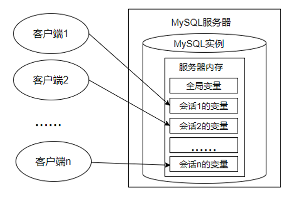

[toc]

# 1、变量

在 `MySQL` 数据库的存储过程和函数中，可以使用变量来存储查询或计算的中间结果数据，或者输出最终的结果数据。

在 `MySQL` 数据库中，变量分为 **系统变量** 以及 **用户自定义变量**。

## 1.1、系统变量

变量由系统定义，不是用户定义，属于 服务器 层面。启动 `MySQL` 服务，生成 `MySQL` 服务实例期间，`MySQL` 将为 `MySQL` 服务器内存中的系统变量赋值，这些系统变量定义了当前 `MySQL` 服务实例的属性、特征。这些系统变量的值要么是编译 `MySQL` 时参数 的默认值，要么是配置文件（例如 `my.ini` 等）中的参数值。可以通过网址 `https://dev.mysql.com/doc/refman/8.0/en/server-systemvariables.html` 查看 `MySQL` 文档的系统变量。

系统变量分为全局系统变量（需要添加 `global` 关键字）以及会话系统变量（需要添加 `session` 关键字），有时也把全局系统变量简称为`全局变量`，有时也把会话系统变量称为 `local变量`。如果不写，默认会话级别。静态变量（在 `MySQL` 服务实例运行期间它们的值不能使用 `set` 动态修改）属于特殊的全局系统变量。

每一个 `MySQL` 客户机成功连接 `MySQL` 服务器后，都会产生与之对应的会话。会话期间，`MySQL`服务实例会在 `MySQL` 服务器内存中生成与该会话对应的会话系统变量，这些会话系统变量的初始值是全局系统变量值的复制。如下图：



- 全局系统变量针对于所有会话（连接）有效，但不能跨重启
- **会话1** 对某个全局系统变量值的修改会导致 **会话2\*** 中同一个全局系统变量值的修改。

在 `MySQL` 中有些系统变量只能是全局的，例如 `max_connections` 用于限制服务器的最大连接数；有些系统变量作用域既可以是全局又可以是会话，例如 `character_set_client` 用于设置客户端的字符集；有些系统变量的作用域只能是当前会话，例如 `pseudo_thread_id` 用于标记当前会话的 `MySQL` 连接 `ID`。

### 1.1.1、查看所有或部分系统变量

查看所有或部分系统变量

> 查看所有全局变量

```sql
mysql> show global variables\G;
*************************** 1. row ***************************
Variable_name: activate_all_roles_on_login
        Value: OFF
*************************** 2. row ***************************
Variable_name: admin_address
        Value:
。。。
*************************** 631. row ***************************
Variable_name: wait_timeout
        Value: 28800
*************************** 632. row ***************************
Variable_name: windowing_use_high_precision
        Value: ON
*************************** 633. row ***************************
Variable_name: xa_detach_on_prepare
        Value: ON
633 rows in set, 1 warning (0.00 sec)

```

> 查看所有会话变量

```sql
mysql> show session variables\G;
*************************** 1. row ***************************
Variable_name: activate_all_roles_on_login
        Value: OFF
*************************** 2. row ***************************
Variable_name: admin_address
        Value:
。。。
*************************** 655. row ***************************
Variable_name: warning_count
        Value: 0
*************************** 656. row ***************************
Variable_name: windowing_use_high_precision
        Value: ON
*************************** 657. row ***************************
Variable_name: xa_detach_on_prepare
        Value: ON
657 rows in set, 1 warning (0.00 sec)
```

> 筛选出满足条件的变量

语法如下:

```sql
# 查看满足条件的部分系统变量。
SHOW GLOBAL VARIABLES LIKE '%标识符%';

# 查看满足条件的部分会话变量
SHOW SESSION VARIABLES LIKE '%标识符%';
```

```sql
mysql> show session variables like 'admin_%';
+------------------------+-----------------+
| Variable_name          | Value           |
+------------------------+-----------------+
| admin_address          |                 |
| admin_port             | 33062           |
| admin_ssl_ca           |                 |
| admin_ssl_capath       |                 |
| admin_ssl_cert         |                 |
| admin_ssl_cipher       |                 |
| admin_ssl_crl          |                 |
| admin_ssl_crlpath      |                 |
| admin_ssl_key          |                 |
| admin_tls_ciphersuites |                 |
| admin_tls_version      | TLSv1.2,TLSv1.3 |
+------------------------+-----------------+
11 rows in set, 1 warning (0.00 sec)

mysql> show global variables like '%character%';
+--------------------------+---------------------------------------------------------+
| Variable_name            | Value                                                   |
+--------------------------+---------------------------------------------------------+
| character_set_client     | utf8mb4                                                 |
| character_set_connection | utf8mb4                                                 |
| character_set_database   | utf8mb4                                                 |
| character_set_filesystem | binary                                                  |
| character_set_results    | utf8mb4                                                 |
| character_set_server     | utf8mb4                                                 |
| character_set_system     | utf8mb3                                                 |
| character_sets_dir       | C:\Program Files\MySQL\MySQL Server 8.0\share\charsets\ |
+--------------------------+---------------------------------------------------------+
8 rows in set, 1 warning (0.00 sec)

mysql>
```

### 1.1.2、查看指定系统变量

作为 `MySQL` 编码规范，`MySQL` 中的系统变量以两个 `@` 开头，其中 `@@global` 仅用于标记全局系统变量，`@@session` 仅用于标记会话系统变量。`@@`首先标记会话系统变量，如果会话系统变量不存在，则标记全局系统变量。

```sql
# 查看指定系统变量的值
SELECT @@global.变量名;

#查看指定的会话变量的值
SELECT @@session.变量名;
#或者
SELECT @@变量名;

# ======================================== 查看部分系统变量 ========================================

mysql> show global variables like 'character_set_client';
+----------------------+---------+
| Variable_name        | Value   |
+----------------------+---------+
| character_set_client | utf8mb4 |
+----------------------+---------+
1 row in set, 1 warning (0.00 sec)

mysql> show session variables like 'character_set_client';
+----------------------+-------+
| Variable_name        | Value |
+----------------------+-------+
| character_set_client | gbk   |
+----------------------+-------+
1 row in set, 1 warning (0.00 sec)

# ======================================== 查看指定系统变量值 ========================================

mysql> select @@global.character_set_client;
+-------------------------------+
| @@global.character_set_client |
+-------------------------------+
| utf8mb4                       |
+-------------------------------+
1 row in set (0.00 sec)

mysql> select @@session.character_set_client;
+--------------------------------+
| @@session.character_set_client |
+--------------------------------+
| gbk                            |
+--------------------------------+
1 row in set (0.00 sec)

mysql>
```

### 1.1.3、修改系统变量的值

有些时候，数据库管理员需要修改系统变量的默认值，以便修改当前会话或者 `MySQL` 服务实例的属性、特征。具体方法：

- 方式1：修改 `MySQL` 配置文件，继而修改 `MySQL` 系统变量的值（该方法需要重启 `MySQL` 服务）
- 方式2：在 `MySQL` 服务运行期间，使用 `set` 命令重新设置系统变量的值

```sql
# 为全局变量赋值
# 方式1：
SET @@global.变量名=变量值;
# 方式2：
SET GLOBAL 变量名=变量值;

# 为某个会话变量赋值
# 方式1：
SET @@session.变量名=变量值;
# 方式2：
SET SESSION 变量名=变量值
```

> 案例

```sql
# ======================================== 修改前查询 ========================================

mysql> select @@session.character_set_client;
+--------------------------------+
| @@session.character_set_client |
+--------------------------------+
| gbk                            |
+--------------------------------+
1 row in set (0.00 sec)

# ======================================== 修改会话变量 ========================================

mysql> set @@session.character_set_client=utf8mb4;
Query OK, 0 rows affected (0.00 sec)

# ======================================== 修改后查询 ========================================
mysql> select @@session.character_set_client;
+--------------------------------+
| @@session.character_set_client |
+--------------------------------+
| utf8mb4                        |
+--------------------------------+
1 row in set (0.00 sec)
```

## 1.2、用户变量

用户变量是用户自己定义的，作为 `MySQL` 编码规范，`MySQL` 中的用户变量以 一个 `@` 开头。根据作用范围不同，又分为 **会话用户变量** 和 **局部变量**。

- 会话用户变量：作用域和会话变量一样，只对当前连接会话有效。
- 局部变量：只在 `BEGIN` 和 `END` 语句块中有效。局部变量只能在存储过程和函数中使用。

### 1.2.1、会话用户变量

> 变量的定义

```sql
# 方式1：=或 :=

SET @用户变量 = 值;
SET @用户变量 := 值


# 方式2：:= 或 INTO 关键字
SELECT @用户变量 := 表达式 [FROM 等子句];
SELECT 表达式 INTO @用户变量  [FROM 等子句];
```

> 查看用户变量的值

```sql
select @用户变量;
```

```sql
# =================================== 查询用户变量,默认为null ===================================
mysql> select @num;
+------+
| @num |
+------+
| NULL |
+------+
1 row in set (0.00 sec)

# =================================== 设置用户变量 ===================================
mysql> select @num := count(*) from emps;
+------------------+
| @num := count(*) |
+------------------+
|                2 |
+------------------+
1 row in set, 1 warning (0.00 sec)

# =================================== 再次查询用户变量 ===================================
mysql> select @num;
+------+
| @num |
+------+
|    2 |
+------+
1 row in set (0.00 sec)


mysql> select @avg;
+------------+
| @avg       |
+------------+
| NULL       |
+------------+
1 row in set (0.00 sec)

# =================================== 设置用户变量的方式二 ===================================

mysql> select avg(salary) into @avg from emps;
Query OK, 1 row affected (0.00 sec)

mysql> select @avg;
+------+
| @avg |
+------+
| 2000 |
+------+
1 row in set (0.00 sec)
```

### 1.2.2、局部变量

- 定义：可以使用 `DECLARE` 语句定义一个局部变量;
- 作用域：仅仅在定义它的 `BEGIN ... END` 中有效;
- 位置：只能放在 `BEGIN ... END` 中，而且只能放在第一;

```sql
BEGIN
# 声明局部变量
DECLARE 变量名1 变量数据类型 [DEFAULT 变量默认值];
DECLARE 变量名2,变量名3,... 变量数据类型 [DEFAULT 变量默认值];
# 为局部变量赋值
SET 变量名1 = 值;
SELECT 值 INTO 变量名2 [FROM 子句];
# 查看局部变量的值
SELECT 变量1,变量2,变量3;
END
```
