[toc]

MySql


# mysql 基础


环境变量配置

```text
在 path 环境变量配置 mysql bin 目录

C:\Program Files\MySQL\MySQL Server 8.0\bin
```


使用 `mysql -V` 或 `mysql --version` 查看版本号

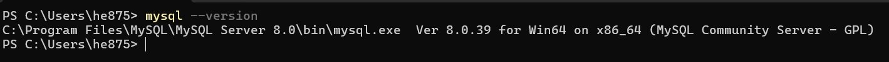


## 登录 mysql

| 命令 | 说明 | 示例 |
| -- | -- | -- |
| `mysql -u 用户 -p` | 本地登录 | `mysql -u root -p` |
| `mysql -u 用户 -P 端口 -h 主机地址 -p` | 远程登录 | `mysql -u root -P 3306 -h 127.0.0.1 -p` |
| `exit` 或 `\q` 或 `quit` | 退出mysql ||


1. 登录本机默认端口号(3306) mysql 服务:  `mysql -u 用户名 -p 密码 `   // 注意，`-p` 后可以直接回车，使用密文登录


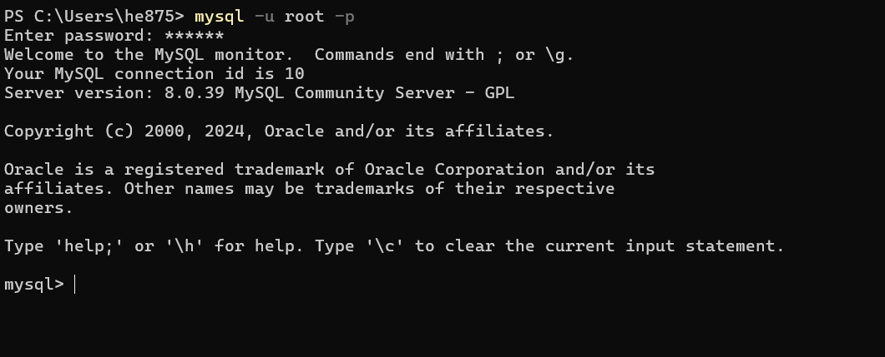


2. 登录本机指定端口号 mysql 服务:  `mysql -u 用户名 -P 端口号 -p`
   

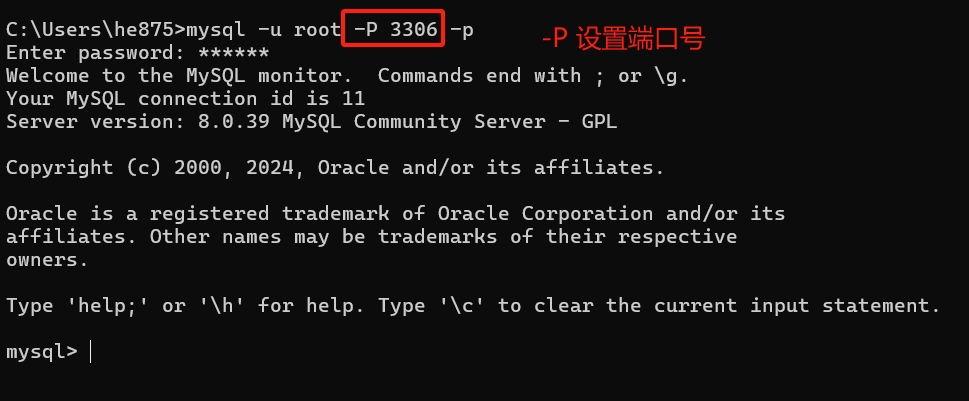


1. 登录指定ip的 mysql 服务: `mysql -u 用户名 -P 端口号 -h 主机ip -p`    	// 例如: 本机 ip 可以使用  `localhost` 或 `127.0.0.1` 


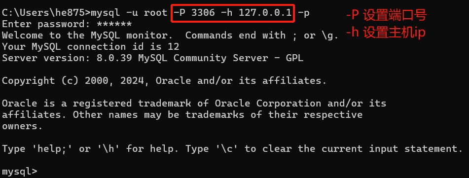


## mysql 目录结构

| 目录 | 说明 |
| -- | -- |
| `C:\Program Files\MySQL\MySQL Server 8.0` | mysql的服务端和客户端的安装主目录 (包含可执行文件、库文件等) |
| `C:\ProgramData\MySQL\MySQL Server 8.0` | 数据存储目录 (由 `datadir`)，存放数据库文件，日志等核心数据(默认隐藏显示) |

> `C:\Program Files\MySQL\MySQL Server 8.0`


> `C:\ProgramData\MySQL\MySQL Server 8.0`


`my.ini` 是 mysql 的主要配置文件;

### `C:\ProgramData\MySQL\MySQL Server 8.0\Data` 数据存储目录 (`datadir`)

存储用户创建的数据库的目录

```text
C:\ProgramData\MySQL\MySQL Server 8.0\Data\

├─mysql                         # 系统数据库目录 (用户、权限等元素据)
├─performance_schema            # 性能监控数据库目录
└─testdb                        # 用户创建的 testdb 数据库目录
        user.ibd                # InnoDB 表的数据和索引文件
```


## 常见操作命令

### 数据库操作命令

| 命令 | 说明 | 示例 |
| -- | -- | -- |
| `show databases;` | 查看所有数据库 ||
| `create database 数据库名;` | 创建数据库 | `create database testdb;` |
| `use 数据库名;` | 使用/切换数据库 | `use testdb;` |
| `drop database 数据库名` | 删除数据库 | `drop database testdb;` |
| `show create database 数据库名;` | 查看数据库创建信息 | `shwo create database testdb;` |


1. `show databases;` 查看所有数据库

```sql
// 显示所有的数据库
show databases;
```

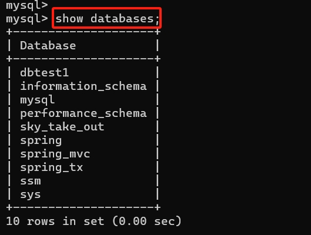

2. `create database 数据库名;` 创建数据库

```sql
// 创建数据库 sql
// create database 数据库名;
create database testdb2;
```

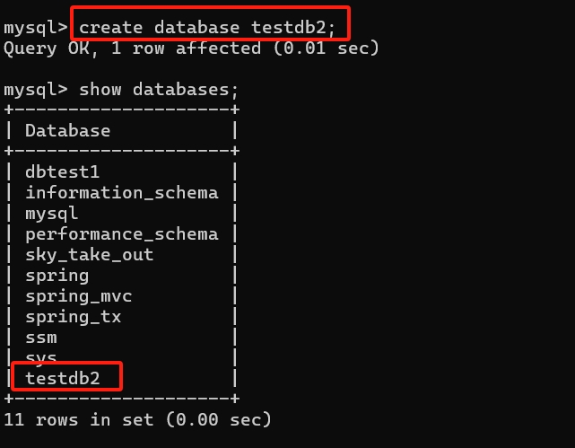

3. `use 数据库名;` 使用数据库

```sql
// 使用数据库 sql
// use 数据库名;
use testdb2;
```


4. `drop database 数据库名;` 删除数据库

```sql
// 删除数据库
// drop database 数据库名;
drop database testdb2;
```

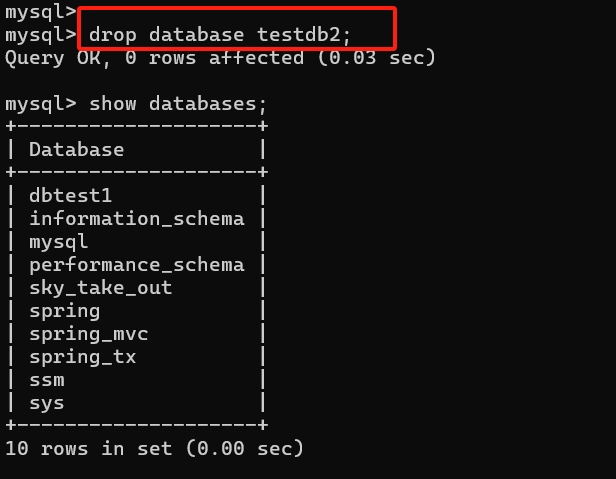


5. `show create database 数据库名;` 查看数据库创建信息

```sql
// 查看数据库创建信息
show create database testdb;
```

执行结果如下:

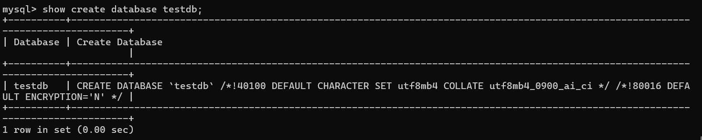

### 数据库表操作命令

| 命令 | 说明 | 示例 |
| -- | -- | -- |
| `show tables;` | 查看当前数据库的所有表 <br/>(注意: 当前命令需要先执行 `use 数据库名;` 命令后才可以执行) |  |
| `create table 表名(...);` | 创建表 | `create table user(id int, name varchar(20), age int);` |
| `show tables from 数据库名;` | 查看指定数据库的所有表 ||
| `desc 表名;` | 查看表结构; | `desc uses;`|
| `drop table 表名;` | 删除表 | `drop table user;` |
| `alter table 表名 ...` | 修改表结构 | `alter table user add email varchar(30);` |
| `show create table 表名;` | 查看数据库表创建信息 | `show create table user;` |


1. `show tables;`

使用 `show tables;` 命令之前需要先使用 `use 数据库名;` 命令设置当前使用的数据库，否则会报如下错误;

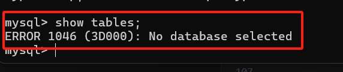

使用 `use 数据库名;` 之后再次执行

```sql
// 先设置当前使用的数据库
use testdb;
// 再执行查询数据库表的命令
show tables;
```

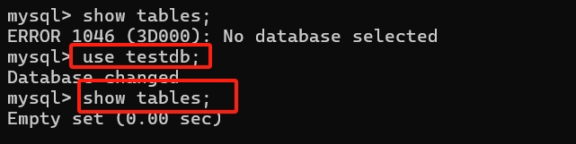


2. `show tables from 数据库名;` 显示指定的数据库中的表;

```sql
// 查看指定数据库中的所有表
// show tables from 数据库名;
show tables from testdb;
```

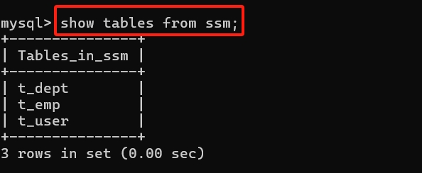


3. `create table 表名(....);` 创建数据库表

```sql
// 创建数据库表 sql
// create table 表名(字段名 数据类型, 字段名 数据类型, ...);
create table user(id int, name varchar(20), age int);
```

执行结果如下

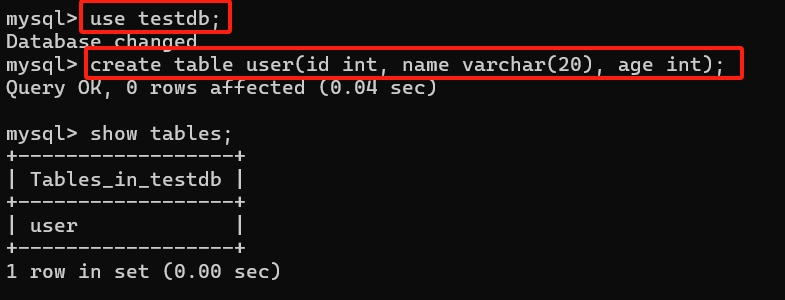


4. `desc 表名;` 查看表结构

```sql
// 查看表结构 sql
desc user;
```

执行结果如下

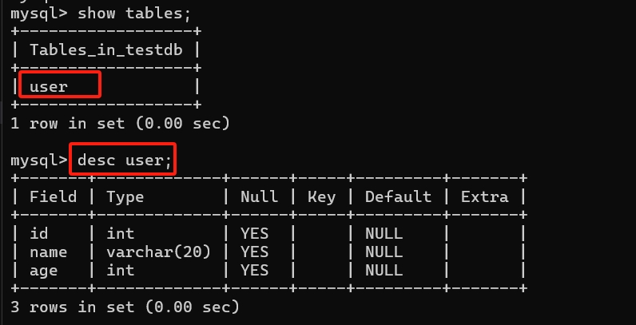


5. `alter table 表名 ...;` 数据库表结构操作 


> 新增一列

```sql
// 新增一列数据 sql
// alter table 表名 add 列名 数据类型;
alter table user add email varchar(50);
```

执行结果如下

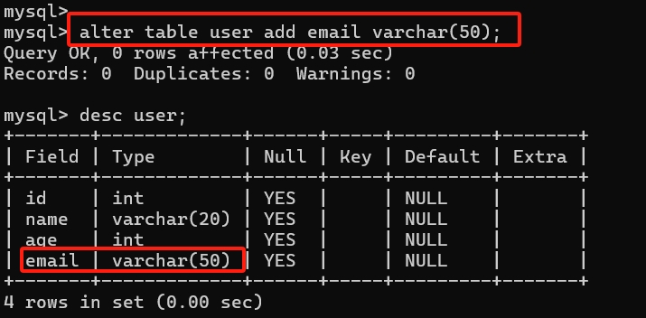

> 修改列信息

```sql
// 修改列信息 sql 结构如下
// alter table 表名 modify column 列名 新数据类型;
alter table user modify column name varchar(50);
```

执行结果如下

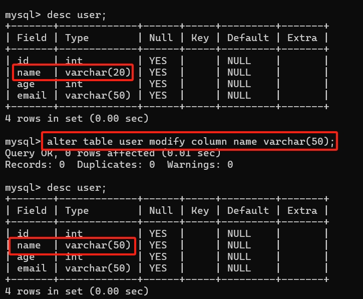


> 修改列名称

```sql
// 修改列名称 sql
// alter table 表名 change column 旧列名 新列名 数据类型;
alter table user change column name username varchar(60);
```

执行结果如下

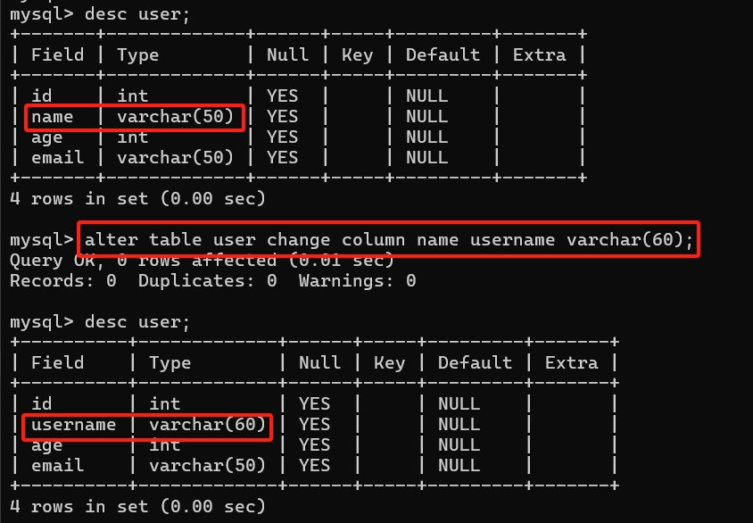


> 删除列

```sql
// 删除列 sql
// alter table 表名 drop column 列名;
alter table user drop column age;
```

执行结果如下


5. `show create table 表名;` 查看数据库表创建信息

```sql
// 查看数据库表创建信息 sql
show create table user;
```

执行结果如下

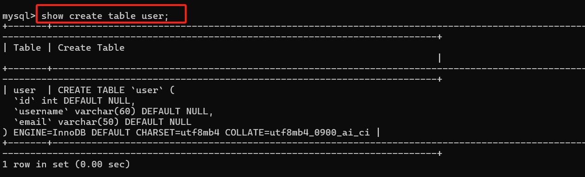


# sql 基础

sql 语言在功能上分为如下三大类:

- `DDL` (`Data Definition Language` 数据定义语言): 定义不同数据库、表、视图、索引等数据库对象，还可以用来创建、删除、修改数据库和数据表的结构;
  - 主要的语句关键字包括 `create`、`drop`、`alter` 等;
- `DML` (`Data Manipulation Language` 数据操作语言): 用于添加、删除、更新和查询数据库记录，并检查数据完整性；
  - 主要的语句关键字包括 `insert`、`delete`、`update`、`select`等;
  - `select` 是sql语言的基础，最为重要;
- `DCL` (`Data Control Language` 数据控制语言):  用于定义数据库、表、字段、用户的访问权限和安全级别;
  - 主要的语句关键字包括 `grant`、`revoke`、`commit`、`rollback`、`savepoint`等;


## sql 语言的规则与规范

- sql 可以写在一行或者多行，为了提高可读性，各子句分行写，必要时使用缩进；
- 每条命令以 `;` 或 `\g` 或 `\G` 结束;
- 关键字不能被缩写，也不能分行;
- 关于标点符号：
  - 必须保证所有的 括号`()`、单引号`''` 、双引号`""` 是成对结束的;
  - 必须使用英文状态下的半角输入方式;
  - 字符串类型和日期时间类型的数据可以使用单引号 ('') 表示;
  - 列的别名，尽量使用双引号 ("")，而且不建议省略 `as`;

### sql 大小写规范 

1. mysql 在 `windows` 环境下是大小写不敏感的;
2. mysql 在 `linux` 环境下是大小写敏感的
   1. 数据库名、表名、表的别名、变量名是严格区分大小写的;
   2. 关键字、函数名、列名(或字段名)、列的别名(字段的别名)是忽略大小的;

推荐统一的书写规范：

1. 数据库名、表名、表别名、字段名、字段别名等都小写；
2. SQL 关键字、函数名、绑定变量等都大写;


### 注释

可以使用如下格式的注释结构

```text
单行注释，使用 #
# 注释内容

单行注释，使用 --  (注意: -- 之后需要跟空格)
-- 注释文字

多行注释，使用 /* */
/* 注释内容 */
```

### 命名规则

1. 数据库名，表名不能超过 30 个字符，变量名限制为为 29 个字符;
2. 数据库名，表名，变量名 只能使用 `A-Z`、`a-z`、`0-9` 和 `_` 共 63 个字符;
3. 数据库名，表名，变量名等对象名中间不能包含空格;
4. 同一个 mysql 软件中数据库不能重名; 同一个数据库中，表不能重名; 同一个表中，变量不能重名;
5. 如果要使用保留字，需要使用反引号包裹

```sql
// 反引号 case: table 和 select 是保留字，不建议使用，如果非要使用需要使用反引号 `` 包裹
create table `table`(id int, `select` varchar(20));
```

### 数据库导入指令

在命令行客户端登录 mysql ，使用 `source` 指令导入 (`source sql文件全路径名`)

```sql
source C:\software\mysql\mysqlNote\sql\testdb.sql
```

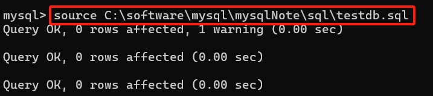

## SELECT 语句

最基本的 `SELECT` 语句: `SElECT 字段1， 字段2, ... FROM 表名;`

```sql
SELECT 1+2, 2*3;
SELECT 1+2, 2*3 FROM DUAL;

# 上述两条语句作用相同，DUAL 表示伪表，得到如下输出

+-----+-----+
| 1+2 | 2*3 |
+-----+-----+
|   3 |   6 |
+-----+-----+
1 row in set (0.00 sec)
```

导入数据库文件 `source atguigu.sql`     // sql 文件详见 [atguigu.sql](./sql/atguigu.sql)


### `SELECT` 没有子句

```sql
SElECT 1; # 没有任何子句
+---+
| 1 |
+---+
| 1 |
+---+
1 row in set (0.00 sec)

SELECT 7/3; # 没有任何子句1
+--------+
| 7/2    |
+--------+
| 3.5000 |
+--------+
1 row in set (0.00 sec)
```

### `SELECT ... FROM`

#### `SELECT` 基本使用

```sql
# 语法
# SELECT 标识选择哪些列 FROM 标识从哪张表中选择;


# 选择全部列
SELECT * FROM departments;
+---------------+-----------------+------------+-------------+
| department_id | department_name | manager_id | location_id |
+---------------+-----------------+------------+-------------+
|            10 | Administration  |        200 |        1700 |
|            20 | Marketing       |        201 |        1800 |
|            30 | Purchasing      |        114 |        1700 |
|            40 | Human Resources |        203 |        2400 |
+---------------+-----------------+------------+-------------+
4 rows in set (0.00 sec)


# 选择特定的列
SELECT department_id, department_name FROM departments;
+---------------+-----------------+
| department_id | department_name |
+---------------+-----------------+
|            10 | Administration  |
|            20 | Marketing       |
|            30 | Purchasing      |
|            40 | Human Resources |
+---------------+-----------------+
4 rows in set (0.00 sec)

```

- 通配符 `*`: 一般情况下，除非需要使用表中所有的字段，否则最好不要使用通配符 `*`。使用通配符虽然可以节省输入查询语句的时间，但是获取不需要的列数据通常会降低查询和所使用的应用程序的效率，通配符的优势是当不知道所需要的列名时，可以通过通配符获取到。
- mysql 中的sql语句是不区分大小写的，因此 `SELECT` 和 `select` 的作用是相同的。

#### 列的别名

1. 列的别名使用 `AS` (`alias`) 关键字，关键字可以省略；
2. 列的别名可以使用一对 `""` 包裹起来，如果别名中包含空格时，就必须使用双引号;


```sql
# 使用 as 关键字，关键字可以省略
SELECT department_id AS dept_id, department_name dept_name FROM departments;

+---------+-----------------+
| dept_id | dept_name       |
+---------+-----------------+
|      10 | Administration  |
|      20 | Marketing       |
|      30 | Purchasing      |
|      40 | Human Resources |
+---------+-----------------+
4 rows in set (0.00 sec)

# 别名可以使用双引号包裹，如果别名包含空格，必须使用双引号包裹
SELECT department_id AS "dept id", department_name "dept name" FROM departments;
+---------+-----------------+
| dept id | dept name       |
+---------+-----------------+
|      10 | Administration  |
|      20 | Marketing       |
|      30 | Purchasing      |
|      40 | Human Resources |
+---------+-----------------+
4 rows in set (0.00 sec)
```

#### 去除重复行

1. 默认情况下查询会返回全部行，包含重复的行;
2. 在 `SELECT` 语句中使用关键字 `DISTINCT` 去除重复行;
3. `DISTINCT` 关键字需要放在所有字段名前面，如果查询的是多个字段，此时去重的判断条件是所有字段组合唯一;

```sql
# 默认包含重复行
select department_id from employees;
+---------------+
| department_id |
+---------------+
|          NULL |
|            10 |
|            20 |
|            20 |
|            30 |
|            30 |
....

# 使用 DISTINCT 关键字去除重复行;
SELECT DISTINCT department_id FROM employees;
+---------------+
| department_id |
+---------------+
|          NULL |
|            10 |
|            20 |
|            30 |
|            40 |
|            50 |
|            60 |
|            70 |
|            80 |
|            90 |
|           100 |
|           110 |
+---------------+
12 rows in set (0.00 sec)

# 查询多个字段使用 distinct 字段，此时去重判断的条件是所有字段组合后是否重复
SELECT DISTINCT department_id, salary FROM employees;
+---------------+----------+
| department_id | salary   |
+---------------+----------+
|            90 | 24000.00 |
|            90 | 17000.00 |
|            60 |  9000.00 |
|            60 |  6000.00 |
|            60 |  4800.00 |
|            60 |  4200.00 |
|           100 | 12000.00 |
|           100 |  9000.00 |
```

#### 空值参与运算

1. 空值: `NULL`;
2. 空值 `NULL` 不等同于 `0`、`''`、`'NULL'`;
3. 空值参与运算，结果也一定是空值;
4. 空值参与运算时，引入 `IFNULL` 解决空值计算为 `NULL` 问题;
5. 在 `mysql` 里，一个空字符串的长度是 0，而一个空值的长度是空。且在 MySQL 里，空值是占空间的。

```sql
# 空值参与运算时，结果也一定是空值
# salary*(1 + commission_pct)*12 计算年工资，commission_pct 为空值时，计算的年工资也是空值

 SELECT employee_id empId, first_name firstName, salary 月工资, salary*(1 + commission_pct)*12 年工资, commission_pct FROM employees;
+-------+-------------+----------+-----------+----------------+
| empId | firstName   | 月工资   | 年工资    | commission_pct |
+-------+-------------+----------+-----------+----------------+
|   142 | Curtis      |  3100.00 |      NULL |           NULL |
|   143 | Randall     |  2600.00 |      NULL |           NULL |
|   144 | Peter       |  2500.00 |      NULL |           NULL |
|   145 | John        | 14000.00 | 235200.00 |           0.40 |
|   146 | Karen       | 13500.00 | 210600.00 |           0.30 |
|   147 | Alberto     | 12000.00 | 187200.00 |           0.30 |


# 使用 IFNULL 解决空值问题;
# IFNULL(commission_pct, 0) 表示 commission_pct 为空值时，使用0替代

SELECT employee_id empId, first_name firstName, salary 月工资, salary*(1 + IFNULL(commission_pct, 0))*12 年工资, commission_pct FROM employees;
+-------+-------------+----------+-----------+----------------+
| empId | firstName   | 月工资   | 年工资    | commission_pct |
+-------+-------------+----------+-----------+----------------+
|   142 | Curtis      |  3100.00 |  37200.00 |           NULL |
|   143 | Randall     |  2600.00 |  31200.00 |           NULL |
|   144 | Peter       |  2500.00 |  30000.00 |           NULL |
|   145 | John        | 14000.00 | 235200.00 |           0.40 |
|   146 | Karen       | 13500.00 | 210600.00 |           0.30 |
|   147 | Alberto     | 12000.00 | 187200.00 |           0.30 |
```

#### 着重号

如果表名，字段名和保留关键字冲突时，需要使用着重号 `` 包裹起来;

```sql
# 错误示例
# ORDER 为保留关键字，直接使用会报错
SELECT * FROM ORDER;

ERROR 1064 (42000): You have an error in your SQL syntax; check the manual that corresponds to your MySQL server version for the right syntax to use near 'ORDER' at line 1

# 使用着重号
SELECT * FROM `ORDER`;
+----------+------------+
| order_id | order_name |
+----------+------------+
|        1 | shkstart   |
|        2 | tomcat     |
|        3 | dubbo      |
+----------+------------+
3 rows in set (0.00 sec)
```


#### 查询常数

`SELECT` 查询还可以对常数进行查询，查询常数时，会在查询结果集中增加一列固定的常数列，这一列的取值就是查询时指定的常数，而不是从表中查询得到;

```sql
# 查询常数, hangzhou, 123 为两个常数
SELECT 'hangzhou', 123, employee_id, last_name FROM employees;

+----------+-----+-------------+-----------+
| hangzhou | 123 | employee_id | last_name |
+----------+-----+-------------+-----------+
| hangzhou | 123 |         100 | King      |
| hangzhou | 123 |         101 | Kochhar   |
| hangzhou | 123 |         102 | De Haan   |
| hangzhou | 123 |         103 | Hunold    |
| hangzhou | 123 |         104 | Ernst     |
| hangzhou | 123 |         105 | Austin    |
+----------+-----+-------------+-----------+
10 rows in set (0.00 sec)
```


### 显示表结构

- `DESCRIBE 表名;`
- `DESC 表名;`  // 简写方式

显示的表结构信息如下:

- `Field`: 字段名称;
- `Type`: 字段类型，这里 barcode, goodsname是文本类型，price是整数类型;
- `Null`: 表示该列是否可以存储 `NULL` 值;
- `Key`: 表示该列是否已经被编制索引。
  - `PRI`: 表示该列是表主键的一部分;
  - `UNI`: 表示该列是 `UNIQUE` 索引的一部分;
  - `MUL`: 表示在列中某个给定值允许出现多次;
- `Default`: 表示该列是否有默认值，如果有，显示对应的默认值;
- `Extra`: 表示可以获取的与给定列有关的附加信息，例如: `AUTO_INCREMENT` 等;

```sql
# 显示表结构信息
DESC employees;
+----------------+-------------+------+-----+---------+-------+
| Field          | Type        | Null | Key | Default | Extra |
+----------------+-------------+------+-----+---------+-------+
| employee_id    | int         | NO   | PRI | 0       |       |
| first_name     | varchar(20) | YES  |     | NULL    |       |
| last_name      | varchar(25) | NO   |     | NULL    |       |
| email          | varchar(25) | NO   | UNI | NULL    |       |
| phone_number   | varchar(20) | YES  |     | NULL    |       |
| hire_date      | date        | NO   |     | NULL    |       |
| job_id         | varchar(10) | NO   | MUL | NULL    |       |
| salary         | double(8,2) | YES  |     | NULL    |       |
| commission_pct | double(2,2) | YES  |     | NULL    |       |
| manager_id     | int         | YES  | MUL | NULL    |       |
| department_id  | int         | YES  | MUL | NULL    |       |
+----------------+-------------+------+-----+---------+-------+
11 rows in set (0.00 sec)
```


# 运算符

## 算数运算符

算数运算符主要用于数学运算，其可以连接运算符前后两个数值或表达式，对数值或表达式进行 加(`+`)、减(`-`)、乘(`*`)、除(`/`) 和 取模(`%`) 运算;

| 运算符 | 名称 | 作用 | 示例 |
| -- | -- | -- | -- |
| `+` | 加法运算符 | 计算两个值或表达式的和 | `SELECT A + B` |
| `-` | 减法运算符 | 计算两个值或表达式的差 | `SELECT A - B` |
| `*` | 乘法运算符 | 计算两个值或表达式的乘积 | `SELECT A * B` |
| `/` | 普通除法运算符 | 计算两个值或表达式的商，无论是否能够被整除，都返回浮点值结果 (例如: 100 / 2 返回 50.0000) | `SELECT A / B` |
| `DIV` | 整数除法运算符 | 计算两个值或表达式的商，无论是否能够被整除，都返回整数结果 (直接截断小数部分，返回商的整数部分, 例如: 100 DIV 3 返回 33) | `SELECT A DIV B` |
| `%` 或 `MOD` | 求模(求余)运算符 | 计算两个值或表达式的余数 | `SELECT A % B` </br> `SELECT A MOD B` |


### 加法与减法运算符

1. 一个整数类型的值对整数进行加法和减法操作，结果还是一个整数;
2. 一个整数类型的值对浮点数进行加法和减法操作，结果是一个浮点数;
3. 加法和减法的优先级相同，进行先加后减操作和进行先减后加操作的结果是一样的;
4. 在Java中，如果加号 (`+`) 的左右两边如果有字符串，那么表示字符串的拼接，但是在 mysql 中 加号 只表示数值相加。如果遇到非数值类型，先尝试转成数值类型，如果转失败，就按照 0 计算。
5. mysql中字符串拼接要使用字符串函数 `CONCAT()` 实现;

```sql
# 加法与减法运算符
SELECT 1, 100, 100 + 1, 100 - 1, 100 + 5 - 3, 100 - 3 + 5, 100 + 1.2, 100 - 1.2 FROM dual;
+---+-----+---------+--------+-------------+-------------+-----------+-----------+
| 1 | 100 | 100 + 1 | 100 -1 | 100 + 5 - 3 | 100 - 3 + 5 | 100 + 1.2 | 100 - 1.2 |
+---+-----+---------+--------+-------------+-------------+-----------+-----------+
| 1 | 100 |     101 |     99 |         102 |         102 |     101.2 |      98.8 |
+---+-----+---------+--------+-------------+-------------+-----------+-----------+
1 row in set (0.00 sec)
```

### 乘法与除法运算符 `*`、`/`、`DIV`

1. 一个数乘以 整数 1 后任然得原数;  // 100 * 1
2. 一个数乘以 浮点数 1 和  除以 浮点数 1 后，变成浮点数，数值与原数相等;  // 100 * 1.0 或 100 / 1.0
3. 一个数除以整数后，不管是否能够除尽，结果都为浮点数;  // 100 / 3  或 100 / 2
4. 一个数除以另一个数，除不尽时，结果为一个浮点数，并保留到小数点后4位;   // 100 / 3
5. 乘法和除法的优先级相同，执行先乘后除与先除后乘操作，得到的结果相同;
6. 在数学运算中，0不能用作除数，在 mysql 中，一个数除以 0 结果为 `NULL`;

- 普通除法 `/`: 无论是否能够整除，结果都是浮点数; (例如：`100 / 3 = 33.3333`、 `100 / 2 = 50.0000`)
- 整数除法 `DIV`: 无论是否能够整除，结果都是直接截断小数部分后的整数; (例如: `100 DIV 3 = 33`、 `100 DIV 2 = 50`)

```sql
# 乘法和除法运算符
SELECT 1, 100, 100 * 1, 100 / 1, 100 * 1.0, 100 / 1.0, 100 / 0, 100 * 3, 100 / 3, 100 DIV 3, 100 / 2, 100 DIV 2 FROM dual;
+---+-----+---------+----------+-----------+-----------+---------+---------+---------+-----------+---------+-----------+
| 1 | 100 | 100 * 1 | 100 / 1  | 100 * 1.0 | 100 / 1.0 | 100 / 0 | 100 * 3 | 100 / 3 | 100 DIV 3 | 100 / 2 | 100 DIV 2 |
+---+-----+---------+----------+-----------+-----------+---------+---------+---------+-----------+---------+-----------+
| 1 | 100 |     100 | 100.0000 |     100.0 |  100.0000 |    NULL |     300 | 33.3333 |        33 | 50.0000 |        50 |
+---+-----+---------+----------+-----------+-----------+---------+---------+---------+-----------+---------+-----------+
1 row in set, 1 warning (0.00 sec)
```

### 求模(求余)运算符 `%`、`MOD`

```sql
# 取余
SELECT 100 % 3, 100 MOD 3, 100 % 5, 100 MOD 5 FROM dual;
+---------+-----------+---------+-----------+
| 100 % 3 | 100 MOD 3 | 100 % 5 | 100 MOD 5 |
+---------+-----------+---------+-----------+
|       1 |         1 |       0 |         0 |
+---------+-----------+---------+-----------+
1 row in set (0.00 sec)
```

## 比较运算符


比较运算符用来对表达式左边的操作数和右边的操作数进行比较，比较结果为真则返回1，比较结果为假返回0，其它情况返回 `NULL`;

比较操作符常被用来作为 `SELECT` 查询语句的条件来使用，返回符合条件的结果记录;

| 运算符 | 名称 | 作用 | 示例 |
| -- | -- | -- | -- |
| `=` | 等于运算符 | 判断两个值、字符串或表达式是否相等 | `SELECT * FROM TABLE WHERE A = B` |
| `<=>` | 安全的等于运算符 | 安全的判断两个值，字符串或表达式是否相等 | `SELECT * FROM TABLE WHERE A <=> B` |
| `<>` 或 `!=` | 不等于运算符 | 判断两个值，字符串或表达式是否不相等 | `SELECT * FROM TABLE WHERE A <> B` </br> 或 </br> `SELECT * FROM TABLE WHERE A != B` |
| `<` | 小于运算符 | 判断前面的值，字符串或表达式是否小于后面的值，字符串或表达式 | `SELECT * FROM TABLE WHERE A < B` |
| `<=` | 小于等于运算符 | 判断前面的值，字符串或表达式是否小于等于后面的值，字符串或表达式 | `SELECT * FROM TABLE WHERE A <= B` |
| `>` | 大于运算符 | 判断前面的值，字符串或表达式是否大于后面的值，字符串或表达式 | `SELECT * FROM TABLE WHERE A > B` |
| `>=` | 大于等于运算符 | 判断前面的值，字符串或表达式是否大于等于后面的值，字符串或表达式 | `SELECT * FROM TABLE WHERE A >= B`|


### 等号运算符 `=`

等号运算符 `=` 判断等号两边的值，字符串或表达式是否相等，如果相等返回1，不相等返回0;

使用等号运算符，遵循如下规则:

1. 如果等号两边的值、字符串或表达式都为字符串，则 mysql 会按照字符串进行比较，其比较的结果是每个字符串中字符的 `ANSI` 编码是否相等;
2. 如果两边的值都是整数，则 mysql 会按照整数来比较两个值的大小;
3. 如果等号两边，一边是整数，一边是字符串，则 mysql 会将字符串转成数字进行比较, 按照开头优先原则:
   - `'123' -> 123`
   - `'123abc' -> 123`
   - `'abc' -> 0`
   - `'abc123' -> 0`
4. 如果等号两边的值、字符串或表达式中有一边为 `NULL`，则比较结果为 `NULL`;


```sql
# 等号运算符
SElECT 1=1, 1='1', 'abc'='abc', 1=NULl, '1'=NULL, ''=NULL, NULL=NULL FROM dual;
+-----+-------+-------------+--------+----------+---------+-----------+
| 1=1 | 1='1' | 'abc'='abc' | 1=NULl | '1'=NULL | ''=NULL | NULL=NULL |
+-----+-------+-------------+--------+----------+---------+-----------+
|   1 |     1 |           1 |   NULL |     NULL |    NULL |      NULL |
+-----+-------+-------------+--------+----------+---------+-----------+

# 等号运算符 字符串转数字比较，mysql
SELECT 1=2, '123'=123, '123abc'=123, 'abc'=123, 'abc'=0, 'abc123'=123 FROM DUAL;
+-----+-----------+--------------+-----------+---------+--------------+
| 1=2 | '123'=123 | '123abc'=123 | 'abc'=123 | 'abc'=0 | 'abc123'=123 |
+-----+-----------+--------------+-----------+---------+--------------+
|   0 |         1 |            1 |         0 |       1 |            0 |
+-----+-----------+--------------+-----------+---------+--------------+
1 row in set, 4 warnings (0.00 sec)
```

### 安全等号运算符 `<=>`

安全等号运算符与等号运算符作用类似，唯一的区别是 安全等号运算符 `<=>` 可以用来对 `NULL` 进行判断，具体区别如下:

- 两个操作数均为 `NULL` 时，其返回值为 1，而不是 `NULL`;
- 当一个操作数为 `NULL` 时，其返回值为 0, 而不是 `NULL`;

```sql
# 安全等号运算符
SELECT 1<=>1, 1<=>2, 1<=>NULL, '1'<=>NULL, 0<=>NULL, NULL<=>NULL FROM dual;
+-------+-------+----------+------------+----------+-------------+
| 1<=>1 | 1<=>2 | 1<=>NULL | '1'<=>NULL | 0<=>NULL | NULL<=>NULL |
+-------+-------+----------+------------+----------+-------------+
|     1 |     0 |        0 |          0 |        0 |           1 |
+-------+-------+----------+------------+----------+-------------+
1 row in set (0.00 sec)
```


### 不等于运算符 `!=`、`<>`

不等于运算符 (`!=`或`<>`) 用于判断两边的数字、字符串或表达式的值是否不相等，如果不相等返回 1， 如果相等返回 0；

不等于运算符不能判断 `NULL` 值，如果两边的值有任意一边为 `NULL` 或者两边的值都为 `NULL`，则比较的结果为 `NULL`;

```sql
# 不等于运算符
SELECT 1!=2, 2<>3, 1!=1, 2<>'2', 2!=NULL, NULL!=NULL FROM dual;
+------+------+------+--------+---------+------------+
| 1!=2 | 2<>3 | 1!=1 | 2<>'2' | 2!=NULL | NULL!=NULL |
+------+------+------+--------+---------+------------+
|    1 |    1 |    0 |      0 |    NULL |       NULL |
+------+------+------+--------+---------+------------+
1 row in set (0.00 sec)
```

## 非符号类型类型运算符

| 运算符 | 名称 | 作用 | 示例 |
| -- | -- | -- | -- |
| `IS NULL` | 判空判断运算符 | 判断值、字符串或表达式是否为空 | `SELECT * FROM TABLE WHERE A IS NULL` |
| `IS NOT NULL` | 非空判断运算符 | 判断值、字符串或表达式是否非空 | `SELECT * FROM TABLE WHERE A IS NOT NULL` |
| `LEAST` | 最小值运算符 | 在多个值中返回最小值 | `SELECT * FROM TABLE WHERE C LEAST(A, B)` |
| `GREATEST` | 最大值运算符 | 在多个值中返回最大值 | `SELECT * FROM TABLE WHERE C GREATEST(A, B)` |
| `BETWEEN AND` | 两个值之间运算符 | 判断一个值是否在两个值之间 | `SELECT * FROM TABLE WHERE C BETWEEN A AND B` |
| `ISNULL` | mysql 为空判断函数 (mysql 特有) | 判断一个值、字符串或表达式是否为空 | `SELECT * FROM TABLE WHERE ISNULL(A)` |
| `IN` | 属于运算符 | 判断一个值是否为列表中的任意一个值 | `SELECT * FROM TABLE WHERE C IN (A, B)` |
| `NOT IN` | 不属于运算符 | 判断一个值是否不是列表中的任意一个值 | `SELECT * FROM TABLE WHERE C NOT IN (A, B)` |
| `LIKE` | 模糊匹配运算符 | 判断一个值是否符合模糊匹配规则 | `SELECT * FROM TABLE WHERE C LIKE B` |
| `REGEXP` | 正则表达式运算符 | 判断一个值是否符合正则表达式的规则 | `SELECT * FROM TABLE WHERE C REGEXP B` |
| `RLIKE` | 正则表达式运算符 | 判断一个值是否符合正则表达式的规则 | `SELECT * FROM TABLE WHERE C RLIKE B` |

### 空运算符

空运算符 `IS NULL` 或 `ISNULL` 判断一个值是否为 `NULL`, 如果为 `NULL` 返回1， 否则返回0；

| 运算符 | 说明 | 示例 |
| -- | -- | -- |
| `IS NULL` | 标准 SQL 运算符 | `SELECT * FROM TABLE WHERE A IS NULL;` |
| `ISNULL` | MYSQL 函数 | `SELECT * FROM TABLE WHERE ISNULL(A);` |

```SQL
# 空运算符
SELECT (1 IS NULL) "1 IS NULL", ISNULL(1) "ISNULL(1)", ISNULL('1') "ISNULL('1')", 0 IS NULL "0 IS NULL", NULL IS NULL FROM DUAL;
+-----------+-----------+-------------+-----------+--------------+
| 1 IS NULL | ISNULL(1) | ISNULL('1') | 0 IS NULL | NULL IS NULL |
+-----------+-----------+-------------+-----------+--------------+
|         0 |         0 |           0 |         0 |            1 |
+-----------+-----------+-------------+-----------+--------------+
1 row in set (0.00 sec)
```

### 非空运算符

非空运算符 `IS NOT NULL` 判断一个值是否不为 `NULL`，如果不为 `NULL` 返回1， 否则范围0;

```sql
# 非空运算符
SELECT 1 IS NOT NULL, 'a' IS NOT NULL, NULL IS NOT NULL FROM dual;
+---------------+-----------------+------------------+
| 1 IS NOT NULL | 'a' IS NOT NULL | NULL IS NOT NULL |
+---------------+-----------------+------------------+
|             1 |               1 |                0 |
+---------------+-----------------+------------------+
1 row in set (0.00 sec)
```

### 最小值运算符

最小值运算符语法格式为 `LEAST(值1， 值2， 值3， ...)`，在有两个或多个参数的情况下，返回最小值;

1. 当参数是整数或浮点数时，`LEAST` 运算符返回其中的最小值;
2. 当参数为字符串时，返回字母表中，顺序最靠前的字符;
3. 当比较列表中有 `NULL` 时，不能判断大小，返回值为 `NULL`;

```sql
# 最小值运算符
SELECT LEAST(1, 3, 4), LEAST('a', 'c', 'b'), LEAST(100, 'a'), LEAST(1, NULL, 2), LEAST(1.0, 'a', 3) FROM dual;
+----------------+----------------------+-----------------+-------------------+--------------------+
| LEAST(1, 3, 4) | LEAST('a', 'c', 'b') | LEAST(100, 'a') | LEAST(1, NULL, 2) | LEAST(1.0, 'a', 3) |
+----------------+----------------------+-----------------+-------------------+--------------------+
|              1 | a                    | 100             |              NULL | 1.0                |
+----------------+----------------------+-----------------+-------------------+--------------------+
1 row in set (0.00 sec)
```

### 最大值运算符

最大值运算符的语法格式为 `GREATEST(值1, 值2, ...)` ，当有两个或多个参数时，返回值为最大值；

如果有任意一个自变量的值为 `NULL` 时，则 `GREATEST()` 运算符返回 `NULL`;

```sql
# 最大值运算符
SELECT GREATEST(1, 5, 2), GREATEST(3, 'a'), GREATEST(1, NULL, 3) FROM DUAL;
+-------------------+------------------+----------------------+
| GREATEST(1, 5, 2) | GREATEST(3, 'a') | GREATEST(1, NULL, 3) |
+-------------------+------------------+----------------------+
|                 5 | a                |                 NULL |
+-------------------+------------------+----------------------+
1 row in set (0.00 sec)
```


### `BETWEEN AND` 运算符

`BETWEEN AND` 运算符使用格式为 `SELECT * FROM TABLE WHERE A BETWEEN C AND B;`，此时 `A >= C && A <=B` 时，返回1， 否则返回0;

```sql
# BETWEEN AND 运算符
SELECT 1 BETWEEN 1 AND 2, 'c' BETWEEN 'a' and 'f', 3 BETWEEN 1 AND 2 FROM dual;
+-------------------+-------------------------+-------------------+
| 1 BETWEEN 1 AND 2 | 'c' BETWEEN 'a' and 'f' | 3 BETWEEN 1 AND 2 |
+-------------------+-------------------------+-------------------+
|                 1 |                       1 |                 0 |
+-------------------+-------------------------+-------------------+
1 row in set (0.00 sec)
```

### `IN` 运算符

`IN` 运算符用于判断给定的值是否是 `IN` 列表中的一个值

- 给定的值是 `IN` 列表中的一个值，返回 1；
- 给定的值不是 `IN` 列表中的一个值，返回 0；
- 如果给定的值为 `NULL` ,则结果为 `NULL`;

IN 运算符实质上是一系列的 `OR` 条件的简写，`1 IN (1, 2, 3)` 等价于 `1 = 1 OR 1 = 2 OR 1 = 3`;

关于 `IN` 列表中存在 `NULL` 值的场景 `1 IN (1, 2, NULL)` 以及 `1 IN (2, 3, NULL)`，需要参考 sql 中的三值逻辑 (`TRUE/FALSE/NULL`) 的运算规则;

1. `1=NULL` -> 返回 (`NULL`) // 任何与 `NULL` 的比较都返回 `NULL
2. `1=1` -> 返回 1 (`true`)
3. `NULL OR 1` -> 返回 1 // `true or null = true`
4. `NULL OR 0` -> 返回 `NULL`
5. `NULL OR NULL` -> 返回 `NULL`


- `1 IN (1, 2, NULL)`: 等价于 `1=1 OR 1=2 OR 1=NULL` 转换为 `TRUE OR FALSE OR NULL`，根据三值逻辑可得最终的结果为 1;
- `1 IN (2, 3, NULL)`: 等价于 `1=2 OR 1=3 OR 1=NULL` 转换为 `FALSE OR FALSE OR NULL`, 根据三值逻辑可得最终的结果为 NULL;

```sql
# IN 运算符
SELECT 1 IN (1, 2, 3), 'a' IN ('a', 'b'), '2' IN (1, 2), NULL IN (1, 2), 1 IN (1, 2, NULL), 1 IN (NULL, 1, 3), 1 IN (2, 3, NULL) FROM dual;
+----------------+-------------------+---------------+----------------+-------------------+-------------------+-------------------+
| 1 IN (1, 2, 3) | 'a' IN ('a', 'b') | '2' IN (1, 2) | NULL IN (1, 2) | 1 IN (1, 2, NULL) | 1 IN (NULL, 1, 3) | 1 IN (2, 3, NULL) |
+----------------+-------------------+---------------+----------------+-------------------+-------------------+-------------------+
|              1 |                 1 |             1 |           NULL |                 1 |                 1 |              NULL |
+----------------+-------------------+---------------+----------------+-------------------+-------------------+-------------------+
1 row in set (0.00 sec)
```

### `NOT IN` 运算符

`NOT IN` 运算符用于判断给定的值是否不是 `IN` 列表中的某一个值，如果不是 `IN` 列表中的某一个值返回 1， 否则返回0;

`NOT IN`运算符的执行机制:

- `x NOT IN (a, b, c)` 实际上被解析为 `x <> a AND x <> b AND x <> c`;
- `1 NOT IN (NULL, 2, 3)` 实际上被解析为 `1 <> NULL AND 1 <> 2 AND 1<>3`;

三值逻辑运算过程:

- `1<>NULL` -> 返回 `NULL`
- `1<>2` -> 返回 `1` (true)
- `1<>3` -> 返回 `1` (true)

`AND` 运算特性中 `NULL AND 1` 返回 `NULL`

```sql
# NOT IN 运算符
SELECT 1 NOT IN (1, 2), 1 NOT IN (2, 3), 'a' NOT IN ('b', 'c'), '1' NOT IN (1, 2), NULL NOT IN (1, 2), 1 NOT IN (NULL, 2, 3) FROM DUAL;
+-----------------+-----------------+-----------------------+-------------------+--------------------+-----------------------+
| 1 NOT IN (1, 2) | 1 NOT IN (2, 3) | 'a' NOT IN ('b', 'c') | '1' NOT IN (1, 2) | NULL NOT IN (1, 2) | 1 NOT IN (NULL, 2, 3) |
+-----------------+-----------------+-----------------------+-------------------+--------------------+-----------------------+
|               0 |               1 |                     1 |                 0 |               NULL |                  NULL |
+-----------------+-----------------+-----------------------+-------------------+--------------------+-----------------------+
1 row in set (0.00 sec)
```

### `LIKE` 运算符

`LIKE` 运算符主要用来匹配字符串，通常用于模糊匹配，如果满足条件则返回1，否则返回0，如果给定的值或匹配的条件为 `NULL`，则返回结果为 `NULL`;

`LIKE` 运算符通常配合以下通配符使用:

- `%`: 匹配 0 个或多个字符;
- `_`: 只能匹配一个字符;

```sql
# LIKE 运算符
SELECT 'abcdef' LIKE '%cde_', 'abcdef' LIKE 'abcdef', 'abc' LIKE 'aa', 'abc' LIKE NULL, NULL LIKE 'abc' FROM dual;
+-----------------------+------------------------+-----------------+-----------------+-----------------+
| 'abcdef' LIKE '%cde_' | 'abcdef' LIKE 'abcdef' | 'abc' LIKE 'aa' | 'abc' LIKE NULL | NULL LIKE 'abc' |
+-----------------------+------------------------+-----------------+-----------------+-----------------+
|                     1 |                      1 |               0 |            NULL |            NULL |
+-----------------------+------------------------+-----------------+-----------------+-----------------+
1 row in set (0.00 sec)
```


### `REGEXP` 运算符

`REGEXP`运算符用来匹配字符串，语法格式为: `expr REGEXP 匹配条件`，如果 `expr` 满足匹配条件，返回1， 否则返回 0，如果 `expr`或匹配条件任意一个为 `NULL`，则结果为 `NULL`;

`REGEXP` 运算符在匹配时，常用的有以下集中通配符：

1. `^`: 匹配以该字符后面的字符开头的字符串;   // `'^abc'`
2. `$`: 匹配以该字符前面字符结尾的字符串;     // `'abc$'`
3. `.`: 匹配任何一个单一字符;
4. `[...]`: 匹配在方括号内的任何字符。例如: `[abc]` 匹配 `a` 或 `b` 或 `c`。
  - 为了命名字符的范围使用一个 `-`。例如: `[a-z]` 匹配任何字母，`[0-9]` 匹配所有数字;
5. `*`: 匹配零个或多个在他前面的字符。例如： `x*` 匹配任何数量的 `x` 字符 (包括0个，1个，多个字符)。 `[0-9]*` 匹配任何数量的数字，而 `*` 匹配任何数量的任何字符串 ;


```sql
# REGEXP 运算符
SELECT 'abc' REGEXP '^ab', 'abc' REGEXP 'c$', 'hkus' REGEXP '^hk' FROM DUAL;
+--------------------+-------------------+---------------------+
| 'abc' REGEXP '^ab' | 'abc' REGEXP 'c$' | 'hkus' REGEXP '^hk' |
+--------------------+-------------------+---------------------+
|                  1 |                 1 |                   1 |
+--------------------+-------------------+---------------------+
1 row in set (0.00 sec)

SELECT 'abc' REGEXP 'a.c' FROM dual;
+--------------------+
| 'abc' REGEXP 'a.c' |
+--------------------+
|                  1 |
+--------------------+
1 row in set (0.00 sec)

SELECT 'HkUs' REGEXP '[a-z]', '1234' REGEXP '[12345]' FROM dual;
+-----------------------+-------------------------+
| 'HkUs' REGEXP '[a-z]' | '1234' REGEXP '[12345]' |
+-----------------------+-------------------------+
|                     1 |                       1 |
+-----------------------+-------------------------+
1 row in set (0.00 sec)

SELECT 'hkus' REGEXP 'P*', 'abc' REGEXP 'p*' FROM dual;
+--------------------+-------------------+
| 'hkus' REGEXP 'P*' | 'abc' REGEXP 'p*' |
+--------------------+-------------------+
|                  1 |                 1 |
+--------------------+-------------------+
1 row in set (0.00 sec)
```


## 逻辑运算符

逻辑运算符主要用来判断表达式的真假，在 mysql 中，逻辑运算符的返回结果为 1 或 0 或 NULL;

mysql 中支持如下的逻辑运算符

| 运算符 | 作用 | 示例 |
| -- | -- | -- |
| `NOT` 或 `!` | 逻辑非 | `SELECT NOT A` |
| `AND` 或 `&&` | 逻辑与 | `SELECT A AND B` </br> 或 </br> `SELECT A && B` |
| `OR` 或 `\|\|`  | 逻辑或 | `SELECT A OR B` </br> 或 </br> `SELECT A \|\| B` |
| `XOR` | 逻辑异或 | `SELECT A XOR B` |


### 逻辑非

逻辑非运算符 `NOT` 或 `!` 计算场景如下:

1. `NOT 1` --> `0`: 当给定的值为非0值时返回0;
2. `NOT 0` --> `1`: 当给定的值为0时返回1;
3. `NOT NULL` --> `NULL`: 当给定的值为 `NULL` 时返回 `NULL`;


```sql
# 逻辑非运算符
SELECT NOT 1, NOT 0, !1, !0, NOT(1+1), NOT !1, NOT NULL, NOT !NULL FROM dual;
+-------+-------+----+----+----------+--------+----------+-----------+
| NOT 1 | NOT 0 | !1 | !0 | NOT(1+1) | NOT !1 | NOT NULL | NOT !NULL |
+-------+-------+----+----+----------+--------+----------+-----------+
|     0 |     1 |  0 |  1 |        0 |      1 |     NULL |      NULL |
+-------+-------+----+----+----------+--------+----------+-----------+
1 row in set, 4 warnings (0.00 sec)
```

### 逻辑与

逻辑与运算符 `AND` 或 `&&` 计算场景如下:

1. `1 AND -1` --> `1`: 当给定的所有值均为非0值，且都不为 `NULL` 时，返回1。
2. `1 AND 0` --> `0`: 当给定的一个值或多个值为0时，返回0；
3. `1 AND NULL` --> `NULL`: 当存在一个值为 `NULL` 时，返回 `NULL`;

```sql
# 逻辑与
SELECT 1 AND -1, 1 && 0, 0 AND 0, 1 AND '0', 1 AND NULL FROM dual;
+----------+--------+---------+-----------+------------+
| 1 AND -1 | 1 && 0 | 0 AND 0 | 1 AND '0' | 1 AND NULL |
+----------+--------+---------+-----------+------------+
|        1 |      0 |       0 |         0 |       NULL |
+----------+--------+---------+-----------+------------+
1 row in set, 1 warning (0.00 sec)
```

### 逻辑或

逻辑或运算符 `OR` 或 `||` 计算场景如下:

1. `1 OR -1` —-> `1`: 是当给定的值都不为 `NULL`，并且任何一个值为 非 0 时，返回1;
2. `1 OR NULL` --> `1`: 当一个值为 `NULL` 另外一个值为 非0值时，返回1;
3. `0 OR NULL` --> `NULL`: 当一个值为0，另外一个值为 `NULL` 时返回 `NULL`;
4. `NULL OR NULL` --> `NULL`: 当两个值都为 `NULL` 时，返回 `NULL`;

```sql
# 逻辑或
SELECT 1 OR -1, 1 OR 0, 0 OR 0, 1 OR NULL, 0 OR NULL, NULL OR NULL FROM dual;
+---------+--------+--------+-----------+-----------+--------------+
| 1 OR -1 | 1 OR 0 | 0 OR 0 | 1 OR NULL | 0 OR NULL | NULL OR NULL |
+---------+--------+--------+-----------+-----------+--------------+
|       1 |      1 |      0 |         1 |      NULL |         NULL |
+---------+--------+--------+-----------+-----------+--------------+
1 row in set (0.00 sec)
```

> 注意： `OR` 可以和 `AND` 一起使用，但是在使用时要注意两者的优先级，由于 `AND` 的优先级高于 `OR`，因此先对 `AND` 两边的操作数进行操作，再与 `OR` 中的操作数结合;


### 逻辑异或

逻辑异或操作符 `XOR` 计算场景如下:

1. `1 XOR -1` --> `0`: 如果两个非 `NULL` 值都为 非0 值时，返回 0;
2. `1 XOR 0` --> `1`：如果两个非 `NULL` 值一个为0，一个为非0时，返回1；
3. `0 XOR 0` --> `0`: 如果两个非 `NULL` 值都为 0 时返回 0;
4. `1 XOR 1 XOR 1` --> `1`: `1 XOR 1` 返回0，然后执行 `0 XOR 1` 返回 1；
5. `1 XOR NULL` --> `NULL`: 给定的值中任意一个值为 `NULL` 时，返回 `NULL`;

```sql
# 异或运算符
SELECT 1 XOR -1, 0 XOR 1, 0 XOR 0, 1 XOR 1 XOR 1, 1 XOR NULL, 0 XOR NULL FROM dual;
+----------+---------+---------+---------------+------------+------------+
| 1 XOR -1 | 0 XOR 1 | 0 XOR 0 | 1 XOR 1 XOR 1 | 1 XOR NULL | 0 XOR NULL |
+----------+---------+---------+---------------+------------+------------+
|        0 |       1 |       0 |             1 |       NULL |       NULL |
+----------+---------+---------+---------------+------------+------------+
1 row in set (0.00 sec)
```


## 位运算符

位运算符是在二进制数上进行计算的运算符。位运算符会先将操作数变成二进制数，然后进行位运算，最后将计算结果变回十进制数。

mysql 支持的位运算符如下:

| 位运算符 | 作用 | 示例 |
| -- | -- | -- |
| `&` | 按位与 (位 AND) | `SElECT A & B` |
| `\|`| 按位或 (位 OR) | `SElECT A \| B` |
| `^` | 按位异或 (位 XOR) | `SElECT A ^ B` |
| `~` | 按位取反 | `SElECT ~A` |
| `>>` | 按位右移 | `SElECT A >> 2` |
| `<<` | 按位左移 | `SElECT A << 2` |


### 按位与

按位与运算符 `&` ，将给定值对应的二进制数逐位进行逻辑与运算，当给定值对应二进制位的数值都为 1 时，返回1，否则返回 0;

```sql
# 按位与
SELECT 1 & 10, 20 & 30, 10 & NULL FROM dual;
+--------+---------+-----------+
| 1 & 10 | 20 & 30 | 10 & NULL |
+--------+---------+-----------+
|      0 |      20 |      NULL |
+--------+---------+-----------+
1 row in set (0.00 sec)

1   ->    0000 0001
10  ->    0000 1010
30  ->    0001 1110
```

### 按位或

按位或运算符 `\|`，将给定值对应的二进制数逐位进行逻辑或运算，当给定值对应二进制位的数值有一个或多个为 1 时，返回1，否则返回0;

```sql
# 按位或
SELECT 1 | 10, 20 | 30, 10 | NULL, 0 | 1, 0 | 0 FROM dual;
+--------+---------+-----------+-------+-------+
| 1 | 10 | 20 | 30 | 10 | NULL | 0 | 1 | 0 | 0 |
+--------+---------+-----------+-------+-------+
|     11 |      30 |      NULL |     1 |     0 |
+--------+---------+-----------+-------+-------+
1 row in set (0.00 sec)

0   ->    0000 0000
1   ->    0000 0001
10  ->    0000 1010
30  ->    0001 1110
```

### 按位异或

按位异或运算符 `^`，将给定值对应的二进制数逐位进行逻辑异或运算，当给定值对应二进制位的数值不同时，则该位返回1，否则返回0;

```sql
# 按位异或运算
SELECT 1 ^ 10, 10 ^ 30, 10 & NULL, 1 ^ 0, 0 ^ 0, 1 ^ 1 FROM dual;
+--------+---------+-----------+-------+-------+-------+
| 1 ^ 10 | 10 ^ 30 | 10 & NULL | 1 ^ 0 | 0 ^ 0 | 1 ^ 1 |
+--------+---------+-----------+-------+-------+-------+
|     11 |      20 |      NULL |     1 |     0 |     0 |
+--------+---------+-----------+-------+-------+-------+
1 row in set (0.00 sec)

0   ->    0000 0000
1   ->    0000 0001
10  ->    0000 1010
30  ->    0001 1110
```

### 按位取反

按位取反运算符 `~` 将给定值的二进制数逐位进行取反操作，即将 1 变为 0，将 0 变为 1;

按位取反运算符 `~` 优先级高于按位与运算符 `~`，所以 `10 & ~1`，首先，对数字 1 进行按位取反操作，结果除了最低为 0 ，其他位都为 1， 然后与 10 进行按位与操作，结果位 10;

```sql
# 按位取反
SELECT ~1, ~10, ~-1, ~0, ~NULL FROM dual;
+----------------------+----------------------+-----+----------------------+-------+
| ~1                   | ~10                  | ~-1 | ~0                   | ~NULL |
+----------------------+----------------------+-----+----------------------+-------+
| 18446744073709551614 | 18446744073709551605 |   0 | 18446744073709551615 |  NULL |
+----------------------+----------------------+-----+----------------------+-------+
1 row in set (0.00 sec)
```

### 按位右移

按位右移运算符 `>>`，将给定值的二进制数的所有位右移指定的位数。右移指定的位数后，右边低位的数值直接被丢弃，左边高位补0;

```sql
# 按位右移运算符
SELECT 1 >> 2, 8 >> 1, 10 >> 2, 0 >> 1, NULL >> 1 FROM dual;
+--------+--------+---------+--------+-----------+
| 1 >> 2 | 8 >> 1 | 10 >> 2 | 0 >> 1 | NULL >> 1 |
+--------+--------+---------+--------+-----------+
|      0 |      4 |       2 |      0 |      NULL |
+--------+--------+---------+--------+-----------+
1 row in set (0.00 sec)

0   ->    0000 0000
1   ->    0000 0001
8   ->    0000 1000
10  ->    0000 1010
```


### 按位左移


按位左移运算符 `<<`，将给定值的二进制数的所有位左移指定的位数。左移指定的位数后，左边高位被移出的数值直接丢弃，右边低位补0;

```sql
### 按位左移运算符
SELECT 1 << 1, 0 << 1, 2 << 4, NULL << 1 FROM dual;
+--------+--------+--------+-----------+
| 1 << 1 | 0 << 1 | 2 << 4 | NULL << 1 |
+--------+--------+--------+-----------+
|      2 |      0 |     32 |      NULL |
+--------+--------+--------+-----------+
1 row in set (0.00 sec)

0   ->    0000 0000
1   ->    0000 0001
2   ->    0000 0010
```


# 排序与分页

## 排序数据

### 排序规则

- 使用 `ORDER BY` 子句排序
  - `ASC (ascend)`: 升序
  - `DESC (DESCEND)`: 降序
- `ORDER BY` 子句在 `SELECT` 语句的结尾;
- `ORDER BY` 可以使用字段的别名;

### 单列排序

```sql
desc employees;
+----------------+-------------+------+-----+---------+-------+
| Field          | Type        | Null | Key | Default | Extra |
+----------------+-------------+------+-----+---------+-------+
| employee_id    | int         | NO   | PRI | 0       |       |
| first_name     | varchar(20) | YES  |     | NULL    |       |
| last_name      | varchar(25) | NO   |     | NULL    |       |
| email          | varchar(25) | NO   | UNI | NULL    |       |
| phone_number   | varchar(20) | YES  |     | NULL    |       |
| hire_date      | date        | NO   |     | NULL    |       |
| job_id         | varchar(10) | NO   | MUL | NULL    |       |
| salary         | double(8,2) | YES  |     | NULL    |       |
| commission_pct | double(2,2) | YES  |     | NULL    |       |
| manager_id     | int         | YES  | MUL | NULL    |       |
| department_id  | int         | YES  | MUL | NULL    |       |
+----------------+-------------+------+-----+---------+-------+
11 rows in set (0.00 sec)

# order by 默认升序排序 asc
select last_name, job_id, department_id, hire_date from employees order by hire_date;
+-------------+------------+---------------+------------+
| last_name   | job_id     | department_id | hire_date  |
+-------------+------------+---------------+------------+
| King        | AD_PRES    |            90 | 1987-06-17 |
| Whalen      | AD_ASST    |            10 | 1987-09-17 |
| Kochhar     | AD_VP      |            90 | 1989-09-21 |
| Hunold      | IT_PROG    |            60 | 1990-01-03 |
| Ernst       | IT_PROG    |            60 | 1991-05-21 |
| De Haan     | AD_VP      |            90 | 1993-01-13 |

# order by 降序排序
select last_name, job_id, department_id, hire_date from employees order by hire_date desc;
+-------------+------------+---------------+------------+
| last_name   | job_id     | department_id | hire_date  |
+-------------+------------+---------------+------------+
| Banda       | SA_REP     |            80 | 2000-04-21 |
| Kumar       | SA_REP     |            80 | 2000-04-21 |
| Ande        | SA_REP     |            80 | 2000-03-24 |
| Markle      | ST_CLERK   |            50 | 2000-03-08 |
| Lee         | SA_REP     |            80 | 2000-02-23 |
| Philtanker  | ST_CLERK   |            50 | 2000-02-06 |

# order by 排序的字段名称可以使用别名，where 子句中不能使用列的别名
select last_name, job_id, department_id, salary 月薪 from employees order by 月薪 desc;
+-------------+------------+---------------+----------+
| last_name   | job_id     | department_id | 月薪     |
+-------------+------------+---------------+----------+
| King        | AD_PRES    |            90 | 24000.00 |
| Kochhar     | AD_VP      |            90 | 17000.00 |
| De Haan     | AD_VP      |            90 | 17000.00 |
| Russell     | SA_MAN     |            80 | 14000.00 |
| Partners    | SA_MAN     |            80 | 13500.00 |
| Hartstein   | MK_MAN     |            20 | 13000.00 |
| Greenberg   | FI_MGR     |           100 | 12000.00 |
| Errazuriz   | SA_MAN     |            80 | 12000.00 |
```

### 多列排序

- 可以使用不在 `SELECT` 列表中的列排序;
- 在对多列进行排序的时候，首先排序的第一列必须有相同的列值，才会对第二列进行排序。如果第一列数据中所有的值都是唯一的，将不再对第二列进行排序;

```sql
# 多列排序
# 现根据 department_id 进行倒序，如果 department_id 相同，根据 salary 字段倒序排序

select last_name, department_id, salary from employees order by department_id, salary desc;
+-------------+---------------+----------+
| last_name   | department_id | salary   |
+-------------+---------------+----------+
| Grant       |          NULL |  7000.00 |
| Whalen      |            10 |  4400.00 |
| Hartstein   |            20 | 13000.00 |
| Fay         |            20 |  6000.00 |
| Raphaely    |            30 | 11000.00 |
| Khoo        |            30 |  3100.00 |
| Baida       |            30 |  2900.00 |
```


## 分页

分页使用场景

- case1: 查询返回的数据记录太多，查看结果非常不方便;
- case2: 表里有4条数据，只想查询第2，3条数据；

### 实现规则

mysql 中使用 `LIMIT` 实现分页，格式如下

```sql
# mysql 传统语法
# 从 位置偏移量 开始，c
LIMIT 位置偏移量, 行数
# 符合标准 sql 的语法
LIMIT 函数 OFFSET 偏移量
```

- 第一个参数 '位置偏移量' 表示 mysql 从哪一行开始显示，是一个可选参数，如果不指定 '位置偏移量', 将会从表中的第一条记录开始 ( 注意: 第一条记录的位置偏移量是0 )
- 第二个参数 '行数' 表示返回的数据条数;

```sql
# 查询表中的前 10 条记录

# 方式一

# 从第一条数据开始查询 10 条数据
select last_name, department_id, salary from employees limit 0, 10;

# 位置偏移量可以省略，省略时，默认值为 0
select last_name, department_id, salary from employees limit 10;

# 方式二

# 查询 10 条数据，起始偏移量位0
select last_name, department_id, salary from employees limit 10 offset 0;

+-----------+---------------+----------+
| last_name | department_id | salary   |
+-----------+---------------+----------+
| King      |            90 | 24000.00 |
| Kochhar   |            90 | 17000.00 |
| De Haan   |            90 | 17000.00 |
| Hunold    |            60 |  9000.00 |
| Ernst     |            60 |  6000.00 |
| Austin    |            60 |  4800.00 |
| Pataballa |            60 |  4800.00 |
| Lorentz   |            60 |  4200.00 |
| Greenberg |           100 | 12000.00 |
| Faviet    |           100 |  9000.00 |
+-----------+---------------+----------+
10 rows in set (0.00 sec)
```

> 分页显示的公式: `limit (当前页数-1) * 每页条数, 每页条数`

```sql
select * from employees limit (pageNo - 1) * pageSize, pageSize;
```

使用 `limit` 子句必须放在整个 select 语句的最后;


# 多表查询


多表查询也称为关联查询，指两个或多个表一起完成查询操作;

前提条件: 这些一起查询的表之间是有关系的 (一对一， 一对多)，它们之间一定是有关联字段，这个关联字段可能建立了外键，也可能没有建立外键。（例如：员工表和部门表通过 部门id 进行关联）


## 笛卡尔积问题

笛卡尔积是一个数学运算。假设有两个集合 x 和 y , 那么 x 和 y 的笛卡尔积就是 x 和 y 的所有可能组合，也就是第一个对象来自于 x，第二个对象来自于 y 的所有可能。组合的个数即为两个集合中元素个数的乘积数;

笛卡尔积也成为 交叉连接 (`cross join`)，它的作用是可以将任意表进行连接，即使这两张表没有关联。

在 mysql 中，以下场景会出现笛卡尔积:

```sql
# 员工表结构
desc employees;
+----------------+-------------+------+-----+---------+-------+
| Field          | Type        | Null | Key | Default | Extra |
+----------------+-------------+------+-----+---------+-------+
| employee_id    | int         | NO   | PRI | 0       |       |
| first_name     | varchar(20) | YES  |     | NULL    |       |
| last_name      | varchar(25) | NO   |     | NULL    |       |
| email          | varchar(25) | NO   | UNI | NULL    |       |
| phone_number   | varchar(20) | YES  |     | NULL    |       |
| hire_date      | date        | NO   |     | NULL    |       |
| job_id         | varchar(10) | NO   | MUL | NULL    |       |
| salary         | double(8,2) | YES  |     | NULL    |       |
| commission_pct | double(2,2) | YES  |     | NULL    |       |
| manager_id     | int         | YES  | MUL | NULL    |       |
| department_id  | int         | YES  | MUL | NULL    |       |
+----------------+-------------+------+-----+---------+-------+
11 rows in set (0.00 sec)

# 部门表结构
desc departments;
+-----------------+-------------+------+-----+---------+-------+
| Field           | Type        | Null | Key | Default | Extra |
+-----------------+-------------+------+-----+---------+-------+
| department_id   | int         | NO   | PRI | 0       |       |
| department_name | varchar(30) | NO   |     | NULL    |       |
| manager_id      | int         | YES  | MUL | NULL    |       |
| location_id     | int         | YES  | MUL | NULL    |       |
+-----------------+-------------+------+-----+---------+-------+
4 rows in set (0.00 sec)

# 查询员工姓名和所在的部门

select last_name, department_name from employees, departments;

select last_name, department_name from employees cross join departments;

select last_name, department_name from employees inner join departments;

select last_name, department_name from employees join departments;
```

> 笛卡尔积问题案例

```sql
# 员工表数量
select count(*) from employees;
+----------+
| count(*) |
+----------+
|      107 |
+----------+
1 row in set (0.00 sec)

# 部门表数量
select count(*) from departments;
+----------+
| count(*) |
+----------+
|       27 |
+----------+
1 row in set (0.00 sec)

# 笛卡尔积数量
select 107 * 27 from dual;
+----------+
| 107 * 27 |
+----------+
|     2889 |
+----------+
1 row in set (0.00 sec)

# 查询员工姓名及其部门名称，不使用关联字段
select last_name, department_name from employees, departments;
+-------------+----------------------+
| last_name   | department_name      |
+-------------+----------------------+
| King        | Payroll              |
| King        | Recruiting           |
| King        | Retail Sales         |
| King        | Government Sales     |
| King        | IT Helpdesk          |
| King        | NOC                  |
| ...         | ....                 |  // 这里省略中间数据
| Gietz       | Finance              |
| Gietz       | Executive            |
| Gietz       | Sales                |
| Gietz       | Public Relations     |
| Gietz       | IT                   |
| Gietz       | Shipping             |
| Gietz       | Human Resources      |
| Gietz       | Purchasing           |
| Gietz       | Marketing            |
| Gietz       | Administration       |
+-------------+----------------------+
2889 rows in set (0.00 sec)
```


## 笛卡尔积问题解决


笛卡尔积的问题会在下面条件下产生:

1. 省略多个表的连接 (或关联条件);
2. 连接条件 (或关联条件) 无效;
3. 所有表中的所有行互相连接；

为了避免笛卡尔积，可以在 where 加入有效的连接条件，加入连接条件后的查询语法:

```sql
select table1.column, table2.column 
from table1, table2
where  table1.column1 = table2.column2;   # 连接条件

# 案例
select last_name, department_name from employees, departments where employees.department_id = departments.department_id;
+-------------+------------------+
| last_name   | department_name  |
+-------------+------------------+
| Whalen      | Administration   |
| Hartstein   | Marketing        |
| Fay         | Marketing        |
| Raphaely    | Purchasing       |
| Khoo        | Purchasing       |
| ......      | .....            |  # 省略中间数据
| Livingston  | Sales            |
| Johnson     | Sales            |
| King        | Executive        |
| Kochhar     | Executive        |
| De Haan     | Executive        |
| Greenberg   | Finance          |
| Faviet      | Finance          |
| Chen        | Finance          |
| Sciarra     | Finance          |
| Urman       | Finance          |
| Popp        | Finance          |
| Higgins     | Accounting       |
| Gietz       | Accounting       |
+-------------+------------------+
106 rows in set (0.00 sec)
```

注意: 如果查询语句中出现了多个表中都存在的字段，则必须指明此字段所在的表;

建议: 从 sql 优化的角度，建议多表查询时，每个字段都指明其所在的表;

## 表的别名

在 mysql 多表查询中，表的别名 `Alias` 用于简化表名，在 `SELECT` 和 `WHERE` 中使用表的别名，避免歧义并提高可读性，基本语法如下:

```sql
SELECT 别名.字段 
FROM 表名 AS 别名   # AS 关键字可以省略
JOIN 另一表名 AS 另一别名 ON 条件;
```

需要注意的是，如果我们使用了表的别名，在 查询字段、过滤条件中就只能使用别名进行代替，不能使用原有的表名，否则会报错，错误信息如下:

```sql
# 过滤条件中最后一个过滤条件使用了 departments.department_id
select a.last_name, a.manager_id, b.department_name from employees as a cross join departments as b where a.department_id = b.department_id and a.manager_id = departments.manager_id;

# 此时报错信息如下
ERROR 1054 (42S22): Unknown column 'departments.manager_id' in 'where clause'
```

正确使用如下:

```sql
# 别名使用
select a.last_name, a.manager_id, b.department_name     # 使用 表别名.字段名
from employees as a     # 定义 employees 表的别名为 a，AS 关键字可以省略
cross join departments as b   # 定义 departments 表的别名为 b
where a.department_id = b.department_id and a.manager_id = b.manager_id;  # where 条件中 也需要使用 表别名.字段名 比较

+------------+------------+-----------------+
| last_name  | manager_id | department_name |
+------------+------------+-----------------+
| Fay        |        201 | Marketing       |
| Khoo       |        114 | Purchasing      |
| Baida      |        114 | Purchasing      |
| Tobias     |        114 | Purchasing      |
| Himuro     |        114 | Purchasing      |
| Colmenares |        114 | Purchasing      |
| Bissot     |        121 | Shipping        |
| Atkinson   |        121 | Shipping        |
| Marlow     |        121 | Shipping        |
| Olson      |        121 | Shipping        |
| Sarchand   |        121 | Shipping        |
| Bull       |        121 | Shipping        |
| Dellinger  |        121 | Shipping        |
| Cabrio     |        121 | Shipping        |
| Ernst      |        103 | IT              |
| Austin     |        103 | IT              |
| Pataballa  |        103 | IT              |
| Lorentz    |        103 | IT              |
| Tucker     |        145 | Sales           |
| Bernstein  |        145 | Sales           |
| Hall       |        145 | Sales           |
| Olsen      |        145 | Sales           |
| Cambrault  |        145 | Sales           |
| Tuvault    |        145 | Sales           |
| Kochhar    |        100 | Executive       |
| De Haan    |        100 | Executive       |
| Faviet     |        108 | Finance         |
| Chen       |        108 | Finance         |
| Sciarra    |        108 | Finance         |
| Urman      |        108 | Finance         |
| Popp       |        108 | Finance         |
| Gietz      |        205 | Accounting      |
+------------+------------+-----------------+
32 rows in set (0.00 sec)
```

> 如果有 `n` 个表实现多表查询，则至少需要 `n-1` 个连接条件。

例如: 查询员工的 `employee_id`, `last_name`, `department_name`, `city`;

```sql
desc employees;
+----------------+-------------+------+-----+---------+-------+
| Field          | Type        | Null | Key | Default | Extra |
+----------------+-------------+------+-----+---------+-------+
| employee_id    | int         | NO   | PRI | 0       |       |
| first_name     | varchar(20) | YES  |     | NULL    |       |
| last_name      | varchar(25) | NO   |     | NULL    |       |
| email          | varchar(25) | NO   | UNI | NULL    |       |
| phone_number   | varchar(20) | YES  |     | NULL    |       |
| hire_date      | date        | NO   |     | NULL    |       |
| job_id         | varchar(10) | NO   | MUL | NULL    |       |
| salary         | double(8,2) | YES  |     | NULL    |       |
| commission_pct | double(2,2) | YES  |     | NULL    |       |
| manager_id     | int         | YES  | MUL | NULL    |       |
| department_id  | int         | YES  | MUL | NULL    |       |
+----------------+-------------+------+-----+---------+-------+
11 rows in set (0.00 sec)

desc departments;
+-----------------+-------------+------+-----+---------+-------+
| Field           | Type        | Null | Key | Default | Extra |
+-----------------+-------------+------+-----+---------+-------+
| department_id   | int         | NO   | PRI | 0       |       |
| department_name | varchar(30) | NO   |     | NULL    |       |
| manager_id      | int         | YES  | MUL | NULL    |       |
| location_id     | int         | YES  | MUL | NULL    |       |
+-----------------+-------------+------+-----+---------+-------+
4 rows in set (0.00 sec)

desc locations;
+----------------+-------------+------+-----+---------+-------+
| Field          | Type        | Null | Key | Default | Extra |
+----------------+-------------+------+-----+---------+-------+
| location_id    | int         | NO   | PRI | 0       |       |
| street_address | varchar(40) | YES  |     | NULL    |       |
| postal_code    | varchar(12) | YES  |     | NULL    |       |
| city           | varchar(30) | NO   |     | NULL    |       |
| state_province | varchar(25) | YES  |     | NULL    |       |
| country_id     | char(2)     | YES  | MUL | NULL    |       |
+----------------+-------------+------+-----+---------+-------+
6 rows in set (0.00 sec)

# 查询员工的 employee_id, last_name, department_name, city

select emp.employee_id, emp.last_name, dept.department_name, loc.city from employees emp, departments dept, locations loc where emp.department_id = dept.department_id and dept.location_id = loc.location_id;

+-------------+-------------+------------------+---------------------+
| employee_id | last_name   | department_name  | city                |
+-------------+-------------+------------------+---------------------+
|         200 | Whalen      | Administration   | Seattle             |
|         201 | Hartstein   | Marketing        | Toronto             |
|         202 | Fay         | Marketing        | Toronto             |
|         ... | ........    | ..........       | .......             |
|         111 | Sciarra     | Finance          | Seattle             |
|         112 | Urman       | Finance          | Seattle             |
|         113 | Popp        | Finance          | Seattle             |
|         205 | Higgins     | Accounting       | Seattle             |
|         206 | Gietz       | Accounting       | Seattle             |
+-------------+-------------+------------------+---------------------+
106 rows in set (0.00 sec)
```

## 多表查询分类

多表查询可以从以下几种角度分类

- 等值连接 vs 非等值连接
- 自连接 vs 非自连接
- 内连接 vs 外连接
  

### 等值连接 vs 非等值连接

> 等值连接

连接条件中使用 等号 (`=`) 比较两个表的字段值，特点如下:

1. 最常见的连接类型;
2. 用于匹配两张表中字段值完全相等的行;

使用场景: 主键关联外键、ID匹配、分类关联等;

```sql
# 等值连接，单个等值条件
select last_name, employees.manager_id, department_name 
from employees, departments 
where employees.department_id = departments.department_id;  # 等值条件

+-------------+------------+------------------+
| last_name   | manager_id | department_name  |
+-------------+------------+------------------+
| Whalen      |        101 | Administration   |
| Hartstein   |        100 | Marketing        |
| Fay         |        201 | Marketing        |
| Raphaely    |        100 | Purchasing       |
| ....        |        ... | ..........       |
| Baida       |        114 | Purchasing       |
| Sciarra     |        108 | Finance          |
| Urman       |        108 | Finance          |
| Popp        |        108 | Finance          |
| Higgins     |        101 | Accounting       |
| Gietz       |        205 | Accounting       |
+-------------+------------+------------------+
106 rows in set (0.00 sec)

# 等值连接，多个等值条件
select last_name, employees.manager_id, department_name 
from employees, departments 
where employees.department_id = departments.department_id and employees.manager_id = departments.manager_id;  # 多个等值条件
+------------+------------+-----------------+
| last_name  | manager_id | department_name |
+------------+------------+-----------------+
| Fay        |        201 | Marketing       |
| Khoo       |        114 | Purchasing      |
| Baida      |        114 | Purchasing      |
| Tobias     |        114 | Purchasing      |
| Himuro     |        114 | Purchasing      |
| Colmenares |        114 | Purchasing      |
| Bissot     |        121 | Shipping        |
| Atkinson   |        121 | Shipping        |
| Marlow     |        121 | Shipping        |
| Olson      |        121 | Shipping        |
| Sarchand   |        121 | Shipping        |
| Bull       |        121 | Shipping        |
| Dellinger  |        121 | Shipping        |
| Cabrio     |        121 | Shipping        |
| Ernst      |        103 | IT              |
| Austin     |        103 | IT              |
| Pataballa  |        103 | IT              |
| Lorentz    |        103 | IT              |
| Tucker     |        145 | Sales           |
| Bernstein  |        145 | Sales           |
| Hall       |        145 | Sales           |
| Olsen      |        145 | Sales           |
| Cambrault  |        145 | Sales           |
| Tuvault    |        145 | Sales           |
| Kochhar    |        100 | Executive       |
| De Haan    |        100 | Executive       |
| Faviet     |        108 | Finance         |
| Chen       |        108 | Finance         |
| Sciarra    |        108 | Finance         |
| Urman      |        108 | Finance         |
| Popp       |        108 | Finance         |
| Gietz      |        205 | Accounting      |
+------------+------------+-----------------+
32 rows in set (0.00 sec)
```

> 非等值连接

非等值连接是指在连接条件中使用 `非等号运算符` (例如: `>`, `<`, `BETWEEN AND`, `!=` 等)，特点如下:

1. 用于匹配两个表中字段值满足某种范围或不等关系；
2. 可能产生笛卡尔积的子集，须谨慎使用;

使用场景: 区间匹配、等级划分、价格范围等;


```sql
select a.last_name, a.salary, b.grade_level from employees as a, job_grades as b where a.salary between b.lowest_sal and b.highest_sal;
```


| 特性 | 等值连接 | 非等值连接 |
| -- | -- | -- |
| 运算符 | `=` | `<`, `>`, `BETWEEN AND`, `!=` 等 |
| 常见场景 | 主外键关联，ID匹配 | 区间匹配，等级划分，范围过滤 |
| 性能 | 通常高效 (索引友好) | 可能低效 (需遍历更多行) |
| 结果集 | 精确匹配的行 | 满足条件的行 (可能包含多对多的关系) |


### 自连接 vs 非自连接


| 特性 | 自连接 | 非自连接 |
| -- | -- | -- |
| 定义 | 同一张表与自身进行连接操作 | 不同表之间的连接操作 |
| 别名必要性 | 必须为表定义别名以区分不同示例 | 无需强制别名 (除非表名一致) |
| 数据关系 | 分析表中记录之间的内部关系 (如:层级、比较) | 分析不同表之间的关联关系 |
| 典型场景 | 层级结构 (员工-经理)、同一实体比较 (同一商品不同时间价格) | 多表关联 (订单-用户、学生-课程) |
| 性能影响 | 可能因表多次扫描导致性能问题。(需索引优化) | 通常更高效 (外键索引支持) |

#### 自连接

自连接时，table1 和 table2 本质上是同一张表，只是用取别名的方式虚拟成两张表以代表不同的意义。然后两个表再进行内连接、外连接等查询;

```sql
desc employees;
+----------------+-------------+------+-----+---------+-------+
| Field          | Type        | Null | Key | Default | Extra |
+----------------+-------------+------+-----+---------+-------+
| employee_id    | int         | NO   | PRI | 0       |       |
| first_name     | varchar(20) | YES  |     | NULL    |       |
| last_name      | varchar(25) | NO   |     | NULL    |       |
| email          | varchar(25) | NO   | UNI | NULL    |       |
| phone_number   | varchar(20) | YES  |     | NULL    |       |
| hire_date      | date        | NO   |     | NULL    |       |
| job_id         | varchar(10) | NO   | MUL | NULL    |       |
| salary         | double(8,2) | YES  |     | NULL    |       |
| commission_pct | double(2,2) | YES  |     | NULL    |       |
| manager_id     | int         | YES  | MUL | NULL    |       |
| department_id  | int         | YES  | MUL | NULL    |       |
+----------------+-------------+------+-----+---------+-------+
11 rows in set (0.00 sec)

# manager_id 也是一个 employee_id
# 查询员工表，返回 emp works for manager 格式的数据
# concat 用于拼接字符串
# concat('a', 'b') 返回 ab
# concat('a', NULL, 'b') 返回 ab

 select concat(emp.last_name, ' works for ', manager.last_name) from employees as emp cross join employees as manager where emp.manager_id = manager.employee_id;

+---------------------------------------------------------+
| concat(emp.last_name, ' works for ', manager.last_name) |
+---------------------------------------------------------+
| Kochhar works for King                                  |
| De Haan works for King                                  |
| Hunold works for De Haan                                |
| Ernst works for Hunold                                  |
| Austin works for Hunold                                 |
| Pataballa works for Hunold                              |
| Lorentz works for Hunold                                |
| Greenberg works for Kochhar                             |
| Faviet works for Greenberg                              |


# 查询出员工 last_name 为 Chen 的 manager 信息;
 select emp.last_name as '员工姓名', manager.last_name as '主管姓名', manager.employee_id as '主管id' from employees as emp cross join employees as manager where emp.last_name = 'Chen' and emp.manager_id = manager.employee_id;
 +----------+-----------+--------+
| 员工姓名 | 主管姓名  | 主管id |
+----------+-----------+--------+
| Chen     | Greenberg |    108 |
+----------+-----------+--------+
```


### 内连接 vs 外连接

- 内连接: 合并具有同一列的两个以上的表的行，**结果集中不包含一个表与另一个表不匹配的行**;
- 外连接: 两个表在连接过程中除了返回满足连接条件的行以外，**还返回了 左(或右) 表中不满足条件的行，这种连接称为 左(或右) 外连接**，没有匹配的行时，结果表中相应的列为空 (`NULL`);
  - 左外连接: 连接条件中，左边的表也称为 主表，右边的表称为 从表;
  - 右外连接: 连接条件中，右边的表也称为 主表，左边的表成为 从表;

| 特性 | 内连接 `INNER JOIN` | 外连接 `OUTER JOIN` |
| -- | -- | -- |
| 结果集 | 仅返回两个表中匹配条件成立的行 | 返回匹配行 + 指定表中未匹配的行 (以 `NULL` 填充缺失值) |
| 核心目的 | 获取两个表的交际数据 | 获取一张表 或 两张表的全集数据，保留未匹配的原始记录 |
| `NULL` 值处理 | 不包含未匹配行，结果集中无 `NULL` | 未匹配部分用 `NULL` 填充 |
| 常规类型 | 只有一种: `INNER JOIN` | 三种类型:</br> &nbsp; `LEFT JOIN` 左外连接</br> &nbsp; `RIGHT JOIN` 右外连接</br> &nbsp; `FULL JOIN` 全外连接 |


#### SQL99语法实现多表查询

使用 `JOIN .. ON ..` 子句创建连接的语法结构

- 使用 `ON` 子句指定额外的连接条件。
- 这个连接条件是与其他条件分开的。
- `ON` 子句使语句具有更高的易读性。
- 关键字 `JOIN`、`INNER JOIN`、`CROSS JOIN` 的含义是一样的，都表示内连接。
- 在 mysql 中，如果使用 `INNER JOIN` 未指定 `ON` 子句时，会隐式的转成 `CROSS JOIN` 生成 笛卡尔积;

```sql
SELECT table1.column, table2.column, table3.column
FROM table1
  JOIN table2 ON table1 和 table2 的连接条件
    JOIN table3 ON table2 和 table3 的连接条件
```

#### 内连接 `INNER JOIN` 实现

语法

```sql
SELECT 字段列表
FROM A表 INNER JOIN B表
ON 关联条件
WHERE 查询条件;
```

查询sql
```sql
select emp.employee_id, emp.last_name, dept.department_id, dept.department_name, loc.location_id, loc.city 
from employees as emp 
inner join departments as dept on emp.department_id = dept.department_id inner join locations as loc on dept.location_id = loc.location_id 
where dept.department_id < 50;

+-------------+------------+---------------+-----------------+-------------+---------+
| employee_id | last_name  | department_id | department_name | location_id | city    |
+-------------+------------+---------------+-----------------+-------------+---------+
|         200 | Whalen     |            10 | Administration  |        1700 | Seattle |
|         201 | Hartstein  |            20 | Marketing       |        1800 | Toronto |
|         202 | Fay        |            20 | Marketing       |        1800 | Toronto |
|         114 | Raphaely   |            30 | Purchasing      |        1700 | Seattle |
|         115 | Khoo       |            30 | Purchasing      |        1700 | Seattle |
|         116 | Baida      |            30 | Purchasing      |        1700 | Seattle |
|         117 | Tobias     |            30 | Purchasing      |        1700 | Seattle |
|         118 | Himuro     |            30 | Purchasing      |        1700 | Seattle |
|         119 | Colmenares |            30 | Purchasing      |        1700 | Seattle |
|         203 | Mavris     |            40 | Human Resources |        2400 | London  |
+-------------+------------+---------------+-----------------+-------------+---------+
10 rows in set (0.01 sec)
```

#### 外连接 `OUTER JOIN` 实现

##### 左外连接 `LEFT JOIN`

保留左表所有行，右表未匹配的行用 `NULL` 填充。

语法

```sql
SELECT 字段列表
FROM A表
LEFT JOIN B表
ON 关联条件
WHERE 查询条件;
```

查询sql
```sql
select emp.last_name, dept.department_name 
from employees as emp 
left join departments as dept 
on emp.department_id = dept.department_id;

+-------------+------------------+
| last_name   | department_name  |
+-------------+------------------+
| King        | Executive        |
| Kochhar     | Executive        |
| .......     | .........        |
| Grant       | NULL             |  # 从表没有匹配的行数据时，对应列的数据使用 NULL 填充
| .......     | ..........       |
| Higgins     | Accounting       |
| Gietz       | Accounting       |
+-------------+------------------+
107 rows in set (0.00 sec)          # 左连接时，返回主表的所有数据
```


##### 右外连接 `RIGHT JOIN`

保留右表所有行，左表未匹配的行用 NULL 填充

右外连接的本质，是将 右表(主表) 的每一行与 左表(从表) 的所有匹配行组合，若从表有多行数据匹配时，主表的数据会重复出现(每次对应一个从表的数据)；

注意：右外连接时，右表(主表) 的数据有可能重复

语法

```sql
SELECT 字段列表
FROM A表 RIGHT JOIN B表
ON 关联条件
WHERE 查询条件;
```

查询sql
```sql
select count(*) from departments;
+----------+
| count(*) |
+----------+
|       27 |
+----------+
1 row in set (0.00 sec)

select count(*) from employees;
+----------+
| count(*) |
+----------+
|      107 |
+----------+
1 row in set (0.00 sec)


select emp.last_name, dept.department_name 
from employees as emp 
right join departments as dept 
on emp.department_id = dept.department_id;
+-------------+----------------------+
| last_name   | department_name      |
+-------------+----------------------+
| Whalen      | Administration       |
| Hartstein   | Marketing            |
| Fay         | Marketing            |   # 右外连接时，右表的数据会匹配出左表中每一个匹配的行数据，因此右表的数据有肯能会重复出现
| Raphaely    | Purchasing           |
| Khoo        | Purchasing           |
| Baida       | Purchasing           |
| Tobias      | Purchasing           |
| Himuro      | Purchasing           |
| Colmenares  | Purchasing           |
| Mavris      | Human Resources      |
| Weiss       | Shipping             |
| Fripp       | Shipping             |
| ........    | ........             |
| NULL        | IT Helpdesk          |    # 右表中的数据没有匹配的坐标数据时，坐标数据使用 null 值填充
| NULL        | Government Sales     |
| NULL        | Retail Sales         |
| NULL        | Recruiting           |
| NULL        | Payroll              |
+-------------+----------------------+
122 rows in set (0.00 sec)
```


## `UNION` 的使用

合并查询结果 使用 `UNION` 关键字，可以给出多条 `SELECT` 语句，并将它们的结果组合成单个结果集。合并时，两个表对应的列数数据类型必须相同，并且相互对应。

各个 `SELECT` 语句之间使用 `UNION` 或 `UNION ALL` 关键字分割，语法格式如下:

```sql
SELECT column1, ... FROM table1
UNION
SELECT column1, ... FROM table2
```

> `UNION` 操作符

`UNION` 操作符返回两个查询结果集的并集，出去重复记录;

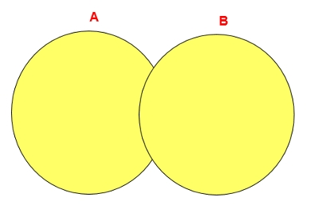

> `UNION ALL` 操作符

`UNION ALL` 操作符返回两个查询结果集的并集，对于两个结果集的重复部分，不去重;

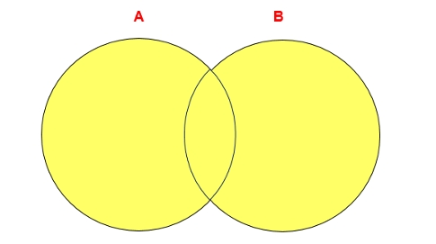


注意: 执行 `UNION ALL` 语句时所需要的资源比 `UNION` 语句少。如果明确知道合并数据后的结果数据不存在重复数据，或者不需要去除重复数据，则尽量使用 `UNION ALL` 语句，以提高数据查询的效率;


case1: 查询部门编号>90或邮箱包含a的员工信息
```sql
# 方式一
select last_name, email, department_id from employees where department_id > 90 or email like '%a%';

# 方式二
select last_name, email, department_id from employees where department_id > 90
UNION
select last_name, email, department_id from employees where email like '%a%';

+------------+----------+---------------+
| last_name  | email    | department_id |
+------------+----------+---------------+
| Kochhar    | NKOCHHAR |            90 |
| De Haan    | LDEHAAN  |            90 |
| Hunold     | AHUNOLD  |            60 |
| Austin     | DAUSTIN  |            60 |
| .........  | ........ |            .. |
| Mavris     | SMAVRIS  |            40 |
| Baer       | HBAER    |            70 |
| Higgins    | SHIGGINS |           110 |
| Gietz      | WGIETZ   |           110 |
+------------+----------+---------------+
67 rows in set (0.00 sec)
```

## 7种 `SQL JOIN` 的实现


> 内连接，取交集  A ∩ B

```sql
# 取两张表的交集
select emp.last_name, dept.department_name from employees as emp inner join departments as dept on emp.department_id = dept.department_id;

+-------------+------------------+
| last_name   | department_name  |
+-------------+------------------+
| Whalen      | Administration   |
| Hartstein   | Marketing        |
| Fay         | Marketing        |
| Raphaely    | Purchasing       |
| Khoo        | Purchasing       |
| ......      | .......          |
| Chen        | Finance          |
| Sciarra     | Finance          |
| Urman       | Finance          |
| Popp        | Finance          |
| Higgins     | Accounting       |
| Gietz       | Accounting       |
+-------------+------------------+
106 rows in set (0.00 sec)            # 不包含 emp 和 dept 中为 NULL 的数据
```

> 左外连接，取左侧表的所有数据

```sql
# 取左表的所有数据
select emp.last_name, dept.department_name from employees as emp left join departments as dept on emp.department_id = dept.department_id;

+-------------+------------------+
| last_name   | department_name  |
+-------------+------------------+
| King        | Executive        |
| Kochhar     | Executive        |
| ......      | ...............  |
| Baer        | Public Relations |
| Higgins     | Accounting       |
| Gietz       | Accounting       |
+-------------+------------------+
107 rows in set (0.00 sec)          # emp 中所有的数据
```

> 右外连接，取右表的所有数据

```sql
# 右外连接，取右表的所有数据
select emp.last_name, dept.department_name from employees as emp right join departments as dept on emp.department_id = dept.department_id;

+-------------+----------------------+
| last_name   | department_name      |
+-------------+----------------------+
| Whalen      | Administration       |
| Hartstein   | Marketing            |
| Fay         | Marketing            |
| Raphaely    | Purchasing           |
| Khoo        | Purchasing           |
| Baida       | Purchasing           |
| Tobias      | Purchasing           |
| Himuro      | Purchasing           |
| ....        | ...                  |
| NULL        | IT Helpdesk          |
| NULL        | Government Sales     |
| NULL        | Retail Sales         |
| NULL        | Recruiting           |
| NULL        | Payroll              |
+-------------+----------------------+
122 rows in set (0.00 sec)              # dept 中所有的数据 + 能够匹配上的所有 emp 数据
```

> 取A表中不包含 AB表交集的部分 A - ( A ∩ B)

```sql
select emp.last_name, dept.department_name from employees as emp left join departments as dept on emp.department_id = dept.department_id where dept.department_id is null;

+-----------+-----------------+
| last_name | department_name |
+-----------+-----------------+
| Grant     | NULL            |
+-----------+-----------------+
1 row in set (0.00 sec)           # emp 中为 null 的数据
```

> 取B表中不包含 AB表交集的部分 B - ( A ∩ B)

```sql
select emp.last_name, dept.department_name from employees as emp right join departments as dept on emp.department_id = dept.department_id where emp.department_id is null;

+-----------+----------------------+
| last_name | department_name      |
+-----------+----------------------+
| NULL      | Treasury             |
| NULL      | Corporate Tax        |
| NULL      | Control And Credit   |
| NULL      | Shareholder Services |
| NULL      | Benefits             |
| NULL      | Manufacturing        |
| NULL      | Construction         |
| NULL      | Contracting          |
| NULL      | Operations           |
| NULL      | IT Support           |
| NULL      | NOC                  |
| NULL      | IT Helpdesk          |
| NULL      | Government Sales     |
| NULL      | Retail Sales         |
| NULL      | Recruiting           |
| NULL      | Payroll              |
+-----------+----------------------+
16 rows in set (0.00 sec)
```

> 满外连接 A U B


```sql
select emp.last_name, dept.department_name from employees as emp left join departments as dept on emp.department_id = dept.department_id where emp.department_id is null
union all
select emp.last_name, dept.department_name from employees as emp right join departments as dept on emp.department_id = dept.department_id;

+-------------+----------------------+
| last_name   | department_name      |
+-------------+----------------------+
| Grant       | NULL                 |
| Whalen      | Administration       |
| Hartstein   | Marketing            |
| Fay         | Marketing            |
| Raphaely    | Purchasing           |
| ....        | ..........           |
| NULL        | NOC                  |
| NULL        | IT Helpdesk          |
| NULL        | Government Sales     |
| NULL        | Retail Sales         |
| NULL        | Recruiting           |
| NULL        | Payroll              |
+-------------+----------------------+
123 rows in set (0.00 sec)
```

> 取 AB 交集之外的数据

```sql
select emp.last_name, dept.department_name from employees as emp left join departments as dept on emp.department_id = dept.department_id where dept.department_id is null
union all
select emp.last_name, dept.department_name from employees as emp right join departments as dept on emp.department_id = dept.department_id where emp.department_id is null;

+-----------+----------------------+
| last_name | department_name      |
+-----------+----------------------+
| Grant     | NULL                 |
| NULL      | Treasury             |
| NULL      | Corporate Tax        |
| NULL      | Control And Credit   |
| NULL      | Shareholder Services |
| NULL      | Benefits             |
| NULL      | Manufacturing        |
| NULL      | Construction         |
| NULL      | Contracting          |
| NULL      | Operations           |
| NULL      | IT Support           |
| NULL      | NOC                  |
| NULL      | IT Helpdesk          |
| NULL      | Government Sales     |
| NULL      | Retail Sales         |
| NULL      | Recruiting           |
| NULL      | Payroll              |
+-----------+----------------------+
17 rows in set (0.00 sec)
```


# 单行函数

## mysql 的内置函数及分类

mysql 提供了丰富的内置函数，这些函数使得数据维护与管理更加方便，能够更好的提供数据的分析与统计功能。

mysql 提供的内置函数从 实现的功能角度 可分为 数值函数、字符串函数、日期和时间函数、流程控制函数、加密与解密函数、获取mysql信息函数、聚合函数等。这里可以将这些丰富的内置函数再分为两类: 单行函数、聚合函数(或分组函数);


