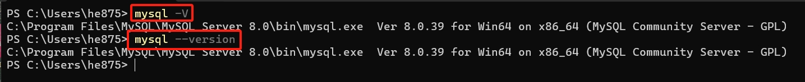
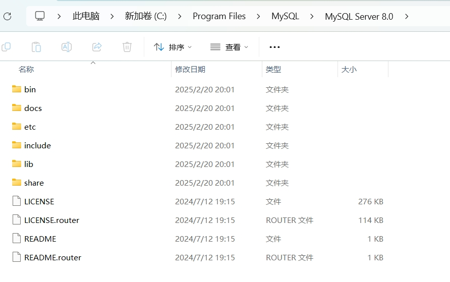
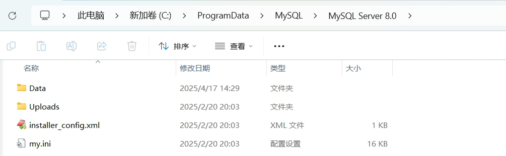

[toc]

MySql


# mysql 基础


环境变量配置

```text
在 path 环境变量配置 mysql bin 目录

C:\Program Files\MySQL\MySQL Server 8.0\bin
```


使用 `mysql -V` 或 `mysql --version` 查看版本号




## 登录 mysql

| 命令 | 说明 | 示例 |
| -- | -- | -- |
| `mysql -u 用户 -p` | 本地登录 | `mysql -u root -p` |
| `mysql -u 用户 -P 端口 -h 主机地址 -p` | 远程登录 | `mysql -u root -P 3306 -h 127.0.0.1 -p` |
| `exit` 或 `\q` 或 `quit` | 退出mysql ||


1. 登录本机默认端口号(3306) mysql 服务:  `mysql -u 用户名 -p 密码 `   // 注意，`-p` 后可以直接回车，使用密文登录


2. 登录本机指定端口号 mysql 服务:  `mysql -u 用户名 -P 端口号 -p`
   


1. 登录指定ip的 mysql 服务: `mysql -u 用户名 -P 端口号 -h 主机ip -p`    	// 例如: 本机 ip 可以使用  `localhost` 或 `127.0.0.1` 


## mysql 目录结构

| 目录 | 说明 |
| -- | -- |
| `C:\Program Files\MySQL\MySQL Server 8.0` | mysql的服务端和客户端的安装主目录 (包含可执行文件、库文件等) |
| `C:\ProgramData\MySQL\MySQL Server 8.0` | 数据存储目录 (由 `datadir`)，存放数据库文件，日志等核心数据(默认隐藏显示) |

> `C:\Program Files\MySQL\MySQL Server 8.0`



> `C:\ProgramData\MySQL\MySQL Server 8.0`



`my.ini` 是 mysql 的主要配置文件;

### `C:\ProgramData\MySQL\MySQL Server 8.0\Data` 数据存储目录 (`datadir`)

存储用户创建的数据库的目录

```text
C:\ProgramData\MySQL\MySQL Server 8.0\Data\

├─mysql                         # 系统数据库目录 (用户、权限等元素据)
├─performance_schema            # 性能监控数据库目录
└─testdb                        # 用户创建的 testdb 数据库目录
        user.ibd                # InnoDB 表的数据和索引文件
```


## 常见操作命令

### 数据库操作命令

| 命令 | 说明 | 示例 |
| -- | -- | -- |
| `show databases;` | 查看所有数据库 ||
| `create database 数据库名;` | 创建数据库 | `create database testdb;` |
| `use 数据库名;` | 使用/切换数据库 | `use testdb;` |
| `drop database 数据库名` | 删除数据库 | `drop database testdb;` |
| `show create database 数据库名;` | 查看数据库创建信息 | `shwo create database testdb;` |


1. `show databases;` 查看所有数据库

```sql
// 显示所有的数据库
show databases;
```


2. `create database 数据库名;` 创建数据库

```sql
// 创建数据库 sql
// create database 数据库名;
create database testdb2;
```


3. `use 数据库名;` 使用数据库

```sql
// 使用数据库 sql
// use 数据库名;
use testdb2;
```


4. `drop database 数据库名;` 删除数据库

```sql
// 删除数据库
// drop database 数据库名;
drop database testdb2;
```


5. `show create database 数据库名;` 查看数据库创建信息

```sql
// 查看数据库创建信息
show create database testdb;
```

执行结果如下:


### 数据库表操作命令

| 命令 | 说明 | 示例 |
| -- | -- | -- |
| `show tables;` | 查看当前数据库的所有表 <br/>(注意: 当前命令需要先执行 `use 数据库名;` 命令后才可以执行) |  |
| `create table 表名(...);` | 创建表 | `create table user(id int, name varchar(20), age int);` |
| `show tables from 数据库名;` | 查看指定数据库的所有表 ||
| `desc 表名;` | 查看表结构; | `desc uses;`|
| `drop table 表名;` | 删除表 | `drop table user;` |
| `alter table 表名 ...` | 修改表结构 | `alter table user add email varchar(30);` |
| `show create table 表名;` | 查看数据库表创建信息 | `show create table user;` |


1. `show tables;`

使用 `show tables;` 命令之前需要先使用 `use 数据库名;` 命令设置当前使用的数据库，否则会报如下错误;


使用 `use 数据库名;` 之后再次执行

```sql
// 先设置当前使用的数据库
use testdb;
// 再执行查询数据库表的命令
show tables;
```


2. `show tables from 数据库名;` 显示指定的数据库中的表;

```sql
// 查看指定数据库中的所有表
// show tables from 数据库名;
show tables from testdb;
```


3. `create table 表名(....);` 创建数据库表

```sql
// 创建数据库表 sql
// create table 表名(字段名 数据类型, 字段名 数据类型, ...);
create table user(id int, name varchar(20), age int);
```

执行结果如下


4. `desc 表名;` 查看表结构

```sql
// 查看表结构 sql
desc user;
```

执行结果如下


5. `alter table 表名 ...;` 数据库表结构操作 


> 新增一列

```sql
// 新增一列数据 sql
// alter table 表名 add 列名 数据类型;
alter table user add email varchar(50);
```

执行结果如下


> 修改列信息

```sql
// 修改列信息 sql 结构如下
// alter table 表名 modify column 列名 新数据类型;
alter table user modify column name varchar(50);
```

执行结果如下


> 修改列名称

```sql
// 修改列名称 sql
// alter table 表名 change column 旧列名 新列名 数据类型;
alter table user change column name username varchar(60);
```

执行结果如下


> 删除列

```sql
// 删除列 sql
// alter table 表名 drop column 列名;
alter table user drop column age;
```

执行结果如下


5. `show create table 表名;` 查看数据库表创建信息

```sql
// 查看数据库表创建信息 sql
show create table user;
```

执行结果如下


