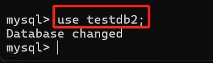
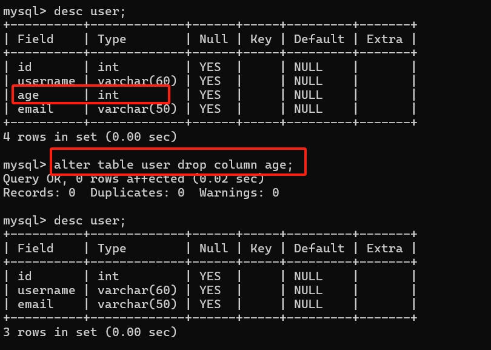

[toc]

MySql


# mysql 基础


环境变量配置

```text
在 path 环境变量配置 mysql bin 目录

C:\Program Files\MySQL\MySQL Server 8.0\bin
```


使用 `mysql -V` 或 `mysql --version` 查看版本号


## 登录 mysql

| 命令 | 说明 | 示例 |
| -- | -- | -- |
| `mysql -u 用户 -p` | 本地登录 | `mysql -u root -p` |
| `mysql -u 用户 -P 端口 -h 主机地址 -p` | 远程登录 | `mysql -u root -P 3306 -h 127.0.0.1 -p` |
| `exit` 或 `\q` 或 `quit` | 退出mysql ||


1. 登录本机默认端口号(3306) mysql 服务:  `mysql -u 用户名 -p 密码 `   // 注意，`-p` 后可以直接回车，使用密文登录


2. 登录本机指定端口号 mysql 服务:  `mysql -u 用户名 -P 端口号 -p`
   


1. 登录指定ip的 mysql 服务: `mysql -u 用户名 -P 端口号 -h 主机ip -p`    	// 例如: 本机 ip 可以使用  `localhost` 或 `127.0.0.1` 


## mysql 目录结构

| 目录 | 说明 |
| -- | -- |
| `C:\Program Files\MySQL\MySQL Server 8.0` | mysql的服务端和客户端的安装主目录 (包含可执行文件、库文件等) |
| `C:\ProgramData\MySQL\MySQL Server 8.0` | 数据存储目录 (由 `datadir`)，存放数据库文件，日志等核心数据(默认隐藏显示) |

> `C:\Program Files\MySQL\MySQL Server 8.0`


> `C:\ProgramData\MySQL\MySQL Server 8.0`


`my.ini` 是 mysql 的主要配置文件;

### `C:\ProgramData\MySQL\MySQL Server 8.0\Data` 数据存储目录 (`datadir`)

存储用户创建的数据库的目录

```text
C:\ProgramData\MySQL\MySQL Server 8.0\Data\

├─mysql                         # 系统数据库目录 (用户、权限等元素据)
├─performance_schema            # 性能监控数据库目录
└─testdb                        # 用户创建的 testdb 数据库目录
        user.ibd                # InnoDB 表的数据和索引文件
```


## 常见操作命令

### 数据库操作命令

| 命令 | 说明 | 示例 |
| -- | -- | -- |
| `show databases;` | 查看所有数据库 ||
| `create database 数据库名;` | 创建数据库 | `create database testdb;` |
| `use 数据库名;` | 使用/切换数据库 | `use testdb;` |
| `drop database 数据库名` | 删除数据库 | `drop database testdb;` |
| `show create database 数据库名;` | 查看数据库创建信息 | `shwo create database testdb;` |


1. `show databases;` 查看所有数据库

```sql
// 显示所有的数据库
show databases;
```


2. `create database 数据库名;` 创建数据库

```sql
// 创建数据库 sql
// create database 数据库名;
create database testdb2;
```


3. `use 数据库名;` 使用数据库

```sql
// 使用数据库 sql
// use 数据库名;
use testdb2;
```



4. `drop database 数据库名;` 删除数据库

```sql
// 删除数据库
// drop database 数据库名;
drop database testdb2;
```


5. `show create database 数据库名;` 查看数据库创建信息

```sql
// 查看数据库创建信息
show create database testdb;
```

执行结果如下:


### 数据库表操作命令

| 命令 | 说明 | 示例 |
| -- | -- | -- |
| `show tables;` | 查看当前数据库的所有表 <br/>(注意: 当前命令需要先执行 `use 数据库名;` 命令后才可以执行) |  |
| `create table 表名(...);` | 创建表 | `create table user(id int, name varchar(20), age int);` |
| `show tables from 数据库名;` | 查看指定数据库的所有表 ||
| `desc 表名;` | 查看表结构; | `desc uses;`|
| `drop table 表名;` | 删除表 | `drop table user;` |
| `alter table 表名 ...` | 修改表结构 | `alter table user add email varchar(30);` |
| `show create table 表名;` | 查看数据库表创建信息 | `show create table user;` |


1. `show tables;`

使用 `show tables;` 命令之前需要先使用 `use 数据库名;` 命令设置当前使用的数据库，否则会报如下错误;


使用 `use 数据库名;` 之后再次执行

```sql
// 先设置当前使用的数据库
use testdb;
// 再执行查询数据库表的命令
show tables;
```


2. `show tables from 数据库名;` 显示指定的数据库中的表;

```sql
// 查看指定数据库中的所有表
// show tables from 数据库名;
show tables from testdb;
```


3. `create table 表名(....);` 创建数据库表

```sql
// 创建数据库表 sql
// create table 表名(字段名 数据类型, 字段名 数据类型, ...);
create table user(id int, name varchar(20), age int);
```

执行结果如下


4. `desc 表名;` 查看表结构

```sql
// 查看表结构 sql
desc user;
```

执行结果如下


5. `alter table 表名 ...;` 数据库表结构操作 


> 新增一列

```sql
// 新增一列数据 sql
// alter table 表名 add 列名 数据类型;
alter table user add email varchar(50);
```

执行结果如下


> 修改列信息

```sql
// 修改列信息 sql 结构如下
// alter table 表名 modify column 列名 新数据类型;
alter table user modify column name varchar(50);
```

执行结果如下


> 修改列名称

```sql
// 修改列名称 sql
// alter table 表名 change column 旧列名 新列名 数据类型;
alter table user change column name username varchar(60);
```

执行结果如下


> 删除列

```sql
// 删除列 sql
// alter table 表名 drop column 列名;
alter table user drop column age;
```

执行结果如下




5. `show create table 表名;` 查看数据库表创建信息

```sql
// 查看数据库表创建信息 sql
show create table user;
```

执行结果如下


# sql 基础

sql 语言在功能上分为如下三大类:

- `DDL` (`Data Definition Language` 数据定义语言): 定义不同数据库、表、视图、索引等数据库对象，还可以用来创建、删除、修改数据库和数据表的结构;
  - 主要的语句关键字包括 `create`、`drop`、`alter` 等;
- `DML` (`Data Manipulation Language` 数据操作语言): 用于添加、删除、更新和查询数据库记录，并检查数据完整性；
  - 主要的语句关键字包括 `insert`、`delete`、`update`、`select`等;
  - `select` 是sql语言的基础，最为重要;
- `DCL` (`Data Control Language` 数据控制语言):  用于定义数据库、表、字段、用户的访问权限和安全级别;
  - 主要的语句关键字包括 `grant`、`revoke`、`commit`、`rollback`、`savepoint`等;


## sql 语言的规则与规范

- sql 可以写在一行或者多行，为了提高可读性，各子句分行写，必要时使用缩进；
- 每条命令以 `;` 或 `\g` 或 `\G` 结束;
- 关键字不能被缩写，也不能分行;
- 关于标点符号：
  - 必须保证所有的 括号`()`、单引号`''` 、双引号`""` 是成对结束的;
  - 必须使用英文状态下的半角输入方式;
  - 字符串类型和日期时间类型的数据可以使用单引号 ('') 表示;
  - 列的别名，尽量使用双引号 ("")，而且不建议省略 `as`;

### sql 大小写规范 

1. mysql 在 `windows` 环境下是大小写不敏感的;
2. mysql 在 `linux` 环境下是大小写敏感的
   1. 数据库名、表名、表的别名、变量名是严格区分大小写的;
   2. 关键字、函数名、列名(或字段名)、列的别名(字段的别名)是忽略大小的;

推荐统一的书写规范：

1. 数据库名、表名、表别名、字段名、字段别名等都小写；
2. SQL 关键字、函数名、绑定变量等都大写;


### 注释

可以使用如下格式的注释结构

```text
单行注释，使用 #
# 注释内容

单行注释，使用 --  (注意: -- 之后需要跟空格)
-- 注释文字

多行注释，使用 /* */
/* 注释内容 */
```

### 命名规则

1. 数据库名，表名不能超过 30 个字符，变量名限制为为 29 个字符;
2. 数据库名，表名，变量名 只能使用 `A-Z`、`a-z`、`0-9` 和 `_` 共 63 个字符;
3. 数据库名，表名，变量名等对象名中间不能包含空格;
4. 同一个 mysql 软件中数据库不能重名; 同一个数据库中，表不能重名; 同一个表中，变量不能重名;
5. 如果要使用保留字，需要使用反引号包裹

```sql
// 反引号 case: table 和 select 是保留字，不建议使用，如果非要使用需要使用反引号 `` 包裹
create table `table`(id int, `select` varchar(20));
```

### 数据库导入指令

在命令行客户端登录 mysql ，使用 `source` 指令导入 (`source sql文件全路径名`)

```sql
source C:\software\mysql\mysqlNote\sql\testdb.sql
```


## SELECT 语句

最基本的 `SELECT` 语句: `SElECT 字段1， 字段2, ... FROM 表名;`

```sql
SELECT 1+2, 2*3;
SELECT 1+2, 2*3 FROM DUAL;

# 上述两条语句作用相同，DUAL 表示伪表，得到如下输出

+-----+-----+
| 1+2 | 2*3 |
+-----+-----+
|   3 |   6 |
+-----+-----+
1 row in set (0.00 sec)
```

导入数据库文件 `source atguigu.sql`     // sql 文件详见 [atguigu.sql](./sql/atguigu.sql)


### `SELECT` 没有子句

```sql
SElECT 1; # 没有任何子句
+---+
| 1 |
+---+
| 1 |
+---+
1 row in set (0.00 sec)

SELECT 7/3; # 没有任何子句1
+--------+
| 7/2    |
+--------+
| 3.5000 |
+--------+
1 row in set (0.00 sec)
```

### `SELECT ... FROM`

#### `SELECT` 基本使用

```sql
# 语法
# SELECT 标识选择哪些列 FROM 标识从哪张表中选择;


# 选择全部列
SELECT * FROM departments;
+---------------+-----------------+------------+-------------+
| department_id | department_name | manager_id | location_id |
+---------------+-----------------+------------+-------------+
|            10 | Administration  |        200 |        1700 |
|            20 | Marketing       |        201 |        1800 |
|            30 | Purchasing      |        114 |        1700 |
|            40 | Human Resources |        203 |        2400 |
+---------------+-----------------+------------+-------------+
4 rows in set (0.00 sec)


# 选择特定的列
SELECT department_id, department_name FROM departments;
+---------------+-----------------+
| department_id | department_name |
+---------------+-----------------+
|            10 | Administration  |
|            20 | Marketing       |
|            30 | Purchasing      |
|            40 | Human Resources |
+---------------+-----------------+
4 rows in set (0.00 sec)

```

- 通配符 `*`: 一般情况下，除非需要使用表中所有的字段，否则最好不要使用通配符 `*`。使用通配符虽然可以节省输入查询语句的时间，但是获取不需要的列数据通常会降低查询和所使用的应用程序的效率，通配符的优势是当不知道所需要的列名时，可以通过通配符获取到。
- mysql 中的sql语句是不区分大小写的，因此 `SELECT` 和 `select` 的作用是相同的。

#### 列的别名

1. 列的别名使用 `AS` (`alias`) 关键字，关键字可以省略；
2. 列的别名可以使用一对 `""` 包裹起来，如果别名中包含空格时，就必须使用双引号;


```sql
# 使用 as 关键字，关键字可以省略
SELECT department_id AS dept_id, department_name dept_name FROM departments;

+---------+-----------------+
| dept_id | dept_name       |
+---------+-----------------+
|      10 | Administration  |
|      20 | Marketing       |
|      30 | Purchasing      |
|      40 | Human Resources |
+---------+-----------------+
4 rows in set (0.00 sec)

# 别名可以使用双引号包裹，如果别名包含空格，必须使用双引号包裹
SELECT department_id AS "dept id", department_name "dept name" FROM departments;
+---------+-----------------+
| dept id | dept name       |
+---------+-----------------+
|      10 | Administration  |
|      20 | Marketing       |
|      30 | Purchasing      |
|      40 | Human Resources |
+---------+-----------------+
4 rows in set (0.00 sec)
```

#### 去除重复行

1. 默认情况下查询会返回全部行，包含重复的行;
2. 在 `SELECT` 语句中使用关键字 `DISTINCT` 去除重复行;
3. `DISTINCT` 关键字需要放在所有字段名前面，如果查询的是多个字段，此时去重的判断条件是所有字段组合唯一;

```sql
# 默认包含重复行
select department_id from employees;
+---------------+
| department_id |
+---------------+
|          NULL |
|            10 |
|            20 |
|            20 |
|            30 |
|            30 |
....

# 使用 DISTINCT 关键字去除重复行;
SELECT DISTINCT department_id FROM employees;
+---------------+
| department_id |
+---------------+
|          NULL |
|            10 |
|            20 |
|            30 |
|            40 |
|            50 |
|            60 |
|            70 |
|            80 |
|            90 |
|           100 |
|           110 |
+---------------+
12 rows in set (0.00 sec)

# 查询多个字段使用 distinct 字段，此时去重判断的条件是所有字段组合后是否重复
SELECT DISTINCT department_id, salary FROM employees;
+---------------+----------+
| department_id | salary   |
+---------------+----------+
|            90 | 24000.00 |
|            90 | 17000.00 |
|            60 |  9000.00 |
|            60 |  6000.00 |
|            60 |  4800.00 |
|            60 |  4200.00 |
|           100 | 12000.00 |
|           100 |  9000.00 |
```

#### 空值参与运算

1. 空值: `NULL`;
2. 空值 `NULL` 不等同于 `0`、`''`、`'NULL'`;
3. 空值参与运算，结果也一定是空值;
4. 空值参与运算时，引入 `IFNULL` 解决空值计算为 `NULL` 问题;
5. 在 `mysql` 里，一个空字符串的长度是 0，而一个空值的长度是空。且在 MySQL 里，空值是占空间的。

```sql
# 空值参与运算时，结果也一定是空值
# salary*(1 + commission_pct)*12 计算年工资，commission_pct 为空值时，计算的年工资也是空值

 SELECT employee_id empId, first_name firstName, salary 月工资, salary*(1 + commission_pct)*12 年工资, commission_pct FROM employees;
+-------+-------------+----------+-----------+----------------+
| empId | firstName   | 月工资   | 年工资    | commission_pct |
+-------+-------------+----------+-----------+----------------+
|   142 | Curtis      |  3100.00 |      NULL |           NULL |
|   143 | Randall     |  2600.00 |      NULL |           NULL |
|   144 | Peter       |  2500.00 |      NULL |           NULL |
|   145 | John        | 14000.00 | 235200.00 |           0.40 |
|   146 | Karen       | 13500.00 | 210600.00 |           0.30 |
|   147 | Alberto     | 12000.00 | 187200.00 |           0.30 |


# 使用 IFNULL 解决空值问题;
# IFNULL(commission_pct, 0) 表示 commission_pct 为空值时，使用0替代

SELECT employee_id empId, first_name firstName, salary 月工资, salary*(1 + IFNULL(commission_pct, 0))*12 年工资, commission_pct FROM employees;
+-------+-------------+----------+-----------+----------------+
| empId | firstName   | 月工资   | 年工资    | commission_pct |
+-------+-------------+----------+-----------+----------------+
|   142 | Curtis      |  3100.00 |  37200.00 |           NULL |
|   143 | Randall     |  2600.00 |  31200.00 |           NULL |
|   144 | Peter       |  2500.00 |  30000.00 |           NULL |
|   145 | John        | 14000.00 | 235200.00 |           0.40 |
|   146 | Karen       | 13500.00 | 210600.00 |           0.30 |
|   147 | Alberto     | 12000.00 | 187200.00 |           0.30 |
```

#### 着重号

如果表名，字段名和保留关键字冲突时，需要使用着重号 `` 包裹起来;

```sql
# 错误示例
# ORDER 为保留关键字，直接使用会报错
SELECT * FROM ORDER;

ERROR 1064 (42000): You have an error in your SQL syntax; check the manual that corresponds to your MySQL server version for the right syntax to use near 'ORDER' at line 1

# 使用着重号
SELECT * FROM `ORDER`;
+----------+------------+
| order_id | order_name |
+----------+------------+
|        1 | shkstart   |
|        2 | tomcat     |
|        3 | dubbo      |
+----------+------------+
3 rows in set (0.00 sec)
```


#### 查询常数

`SELECT` 查询还可以对常数进行查询，查询常数时，会在查询结果集中增加一列固定的常数列，这一列的取值就是查询时指定的常数，而不是从表中查询得到;

```sql
# 查询常数, hangzhou, 123 为两个常数
SELECT 'hangzhou', 123, employee_id, last_name FROM employees;

+----------+-----+-------------+-----------+
| hangzhou | 123 | employee_id | last_name |
+----------+-----+-------------+-----------+
| hangzhou | 123 |         100 | King      |
| hangzhou | 123 |         101 | Kochhar   |
| hangzhou | 123 |         102 | De Haan   |
| hangzhou | 123 |         103 | Hunold    |
| hangzhou | 123 |         104 | Ernst     |
| hangzhou | 123 |         105 | Austin    |
+----------+-----+-------------+-----------+
10 rows in set (0.00 sec)
```


### 显示表结构

- `DESCRIBE 表名;`
- `DESC 表名;`  // 简写方式

显示的表结构信息如下:

- `Field`: 字段名称;
- `Type`: 字段类型，这里 barcode, goodsname是文本类型，price是整数类型;
- `Null`: 表示该列是否可以存储 `NULL` 值;
- `Key`: 表示该列是否已经被编制索引。
  - `PRI`: 表示该列是表主键的一部分;
  - `UNI`: 表示该列是 `UNIQUE` 索引的一部分;
  - `MUL`: 表示在列中某个给定值允许出现多次;
- `Default`: 表示该列是否有默认值，如果有，显示对应的默认值;
- `Extra`: 表示可以获取的与给定列有关的附加信息，例如: `AUTO_INCREMENT` 等;

```sql
# 显示表结构信息
DESC employees;
+----------------+-------------+------+-----+---------+-------+
| Field          | Type        | Null | Key | Default | Extra |
+----------------+-------------+------+-----+---------+-------+
| employee_id    | int         | NO   | PRI | 0       |       |
| first_name     | varchar(20) | YES  |     | NULL    |       |
| last_name      | varchar(25) | NO   |     | NULL    |       |
| email          | varchar(25) | NO   | UNI | NULL    |       |
| phone_number   | varchar(20) | YES  |     | NULL    |       |
| hire_date      | date        | NO   |     | NULL    |       |
| job_id         | varchar(10) | NO   | MUL | NULL    |       |
| salary         | double(8,2) | YES  |     | NULL    |       |
| commission_pct | double(2,2) | YES  |     | NULL    |       |
| manager_id     | int         | YES  | MUL | NULL    |       |
| department_id  | int         | YES  | MUL | NULL    |       |
+----------------+-------------+------+-----+---------+-------+
11 rows in set (0.00 sec)
```


